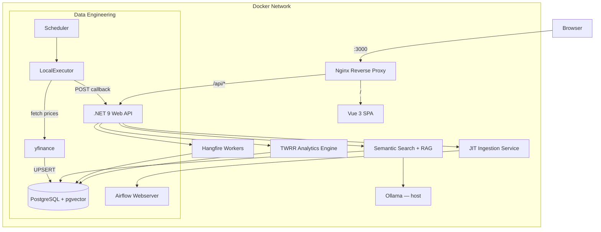
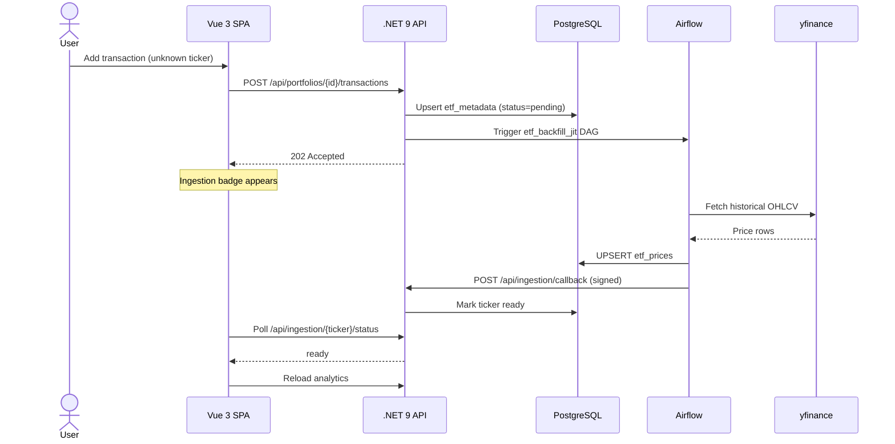
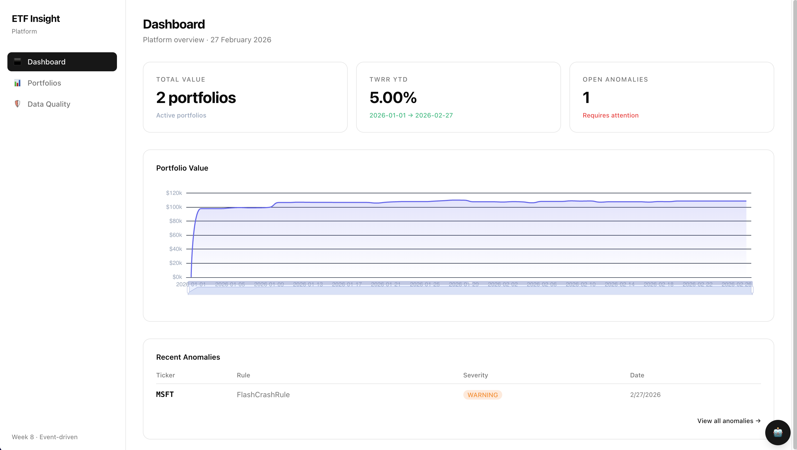
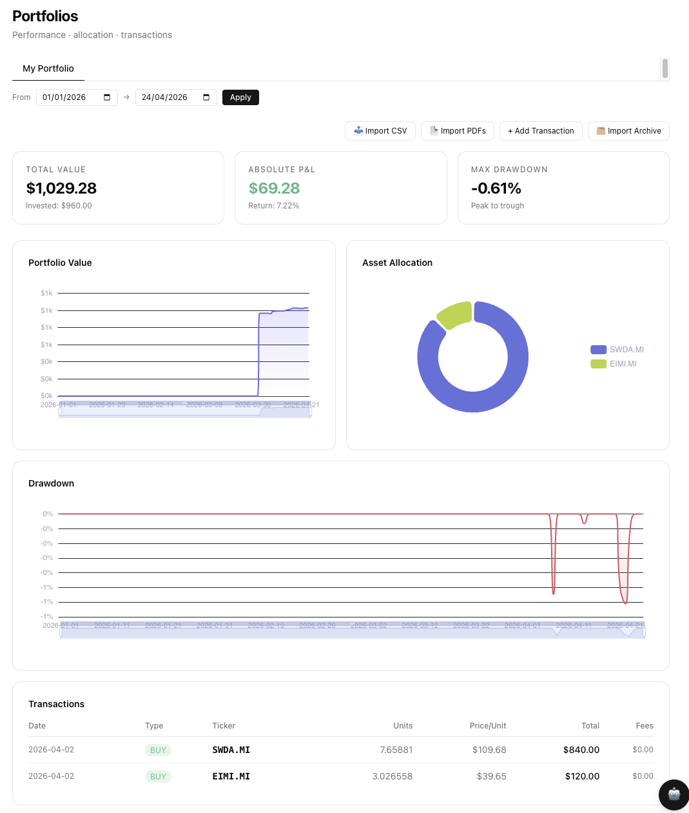
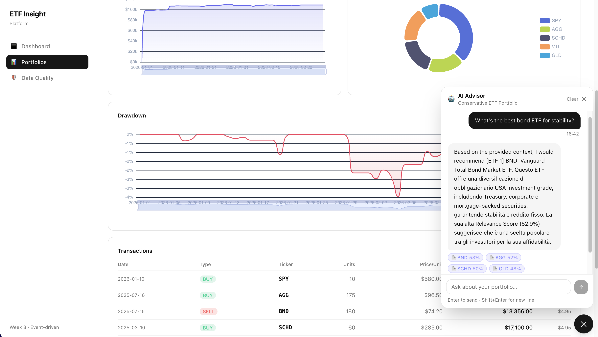
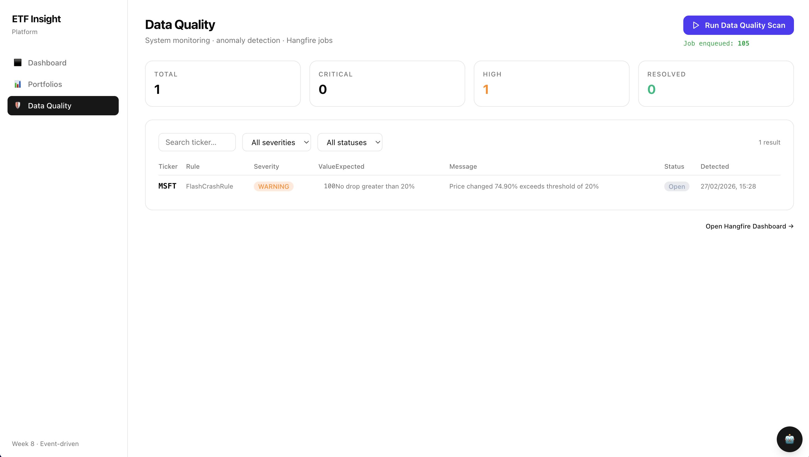
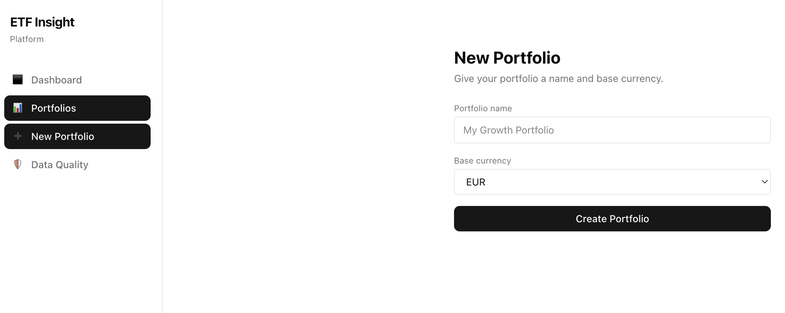
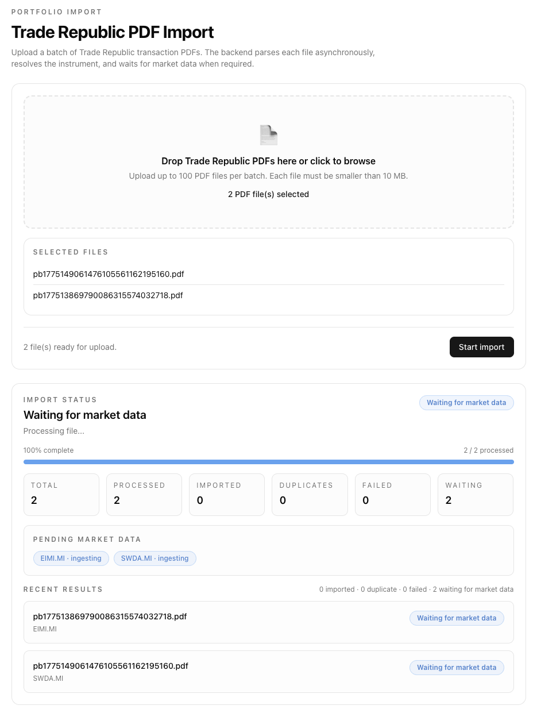
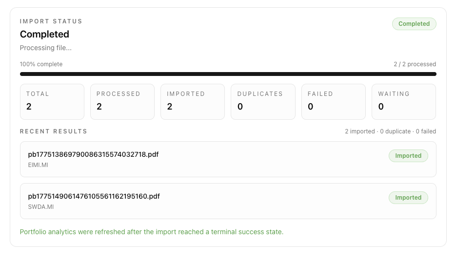
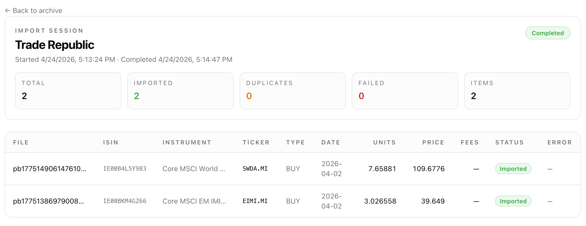

# ETFInsight

**An AI-powered investment portfolio platform that combines rigorous performance analytics, local RAG, and event-driven data pipelines — all running on your machine.**

[](https://dotnet.microsoft.com/)
[](https://vuejs.org/)
[](https://www.postgresql.org/)
[](https://airflow.apache.org/)
[](https://docs.docker.com/compose/)
[](LICENSE)

---

## What is ETFInsight?

Most portfolio trackers tell you *how much* you have. ETFInsight is designed to tell you *why* your portfolio moves — using a custom analytics engine and a locally-hosted LLM that can answer questions like:

> *"Why is my tech exposure risky right now?"*  
> *"Find me defensive ETFs similar to this one."*

It is a full-stack, self-hosted platform built on Clean Architecture and Domain-Driven Design. Prices are fetched on demand (no pre-loaded symbol database required), analytics are computed deterministically in .NET, and AI context is injected from pgvector — never hallucinated by the model.

---

## Why ETFInsight?

- **Local-first AI.** Embeddings and inference run through Ollama on your host. No API keys, no data leaving your machine.
- **JIT ingestion.** Add a transaction for any ticker. The platform fetches its full price history automatically via Airflow, then notifies the UI when ready.
- **Correct math.** Time-Weighted Rate of Return (TWRR), daily valuations, PnL, drawdowns — computed server-side, not in the browser.
- **No sign-up required.** Guest-session multi-tenancy via a browser UUID. Portfolios are isolated without authentication overhead.
- **Production-grade internals.** Event-driven background jobs (Hangfire), anomaly detection, data quality scanning, and signed Airflow callbacks — not just a CRUD app.

---

## Architecture

The system runs entirely inside a Docker network behind an Nginx reverse proxy. Airflow handles all data engineering. The .NET API owns all domain logic and exposes a REST surface to the Vue 3 SPA.



### JIT Ingestion Flow

When a user adds a transaction for an unknown ticker:



---

## Quick Start

**Prerequisites:** Docker Desktop, [Ollama](https://ollama.com/) running on the host.

```bash
ollama pull nomic-embed-text
ollama pull llama3.2
```

```bash
git clone https://github.com/simoneriggi92/ETFInsight.git
cd ETFInsight/infra
docker compose up --build -d
```

| Service            | URL                            |
| ------------------ | ------------------------------ |
| Web App            | http://localhost:3000          |
| API / Swagger      | http://localhost:5001          |
| Airflow            | http://localhost:8090          |
| Hangfire           | http://localhost:5001/hangfire |
| Health check       | http://localhost:5001/health   |

---

## Features

### Portfolio Analytics
- Time-Weighted Rate of Return (TWRR) with cash-flow awareness
- Daily valuation history, PnL, and simple return
- Peak equity and max drawdown tracking

### AI Advisor (Local RAG)
- Embeddings stored in PostgreSQL via `pgvector`
- Semantic search over ETF knowledge documents
- Ollama-powered chat with deterministic portfolio context injected into the prompt — the LLM never computes financial metrics

### Just-in-Time Ingestion
- Add any ticker without pre-loading a symbol database
- Airflow fetches full OHLCV history and triggers a signed callback
- Frontend polls status and auto-refreshes analytics when ready

### CSV Bulk Import
- `multipart/form-data` upload via the UI
- Parsed with CsvHelper; invalid rows are returned, not fatal
- Each distinct ticker runs through the same JIT flow as manual entry

### Data Quality
- Hangfire-scheduled anomaly scans
- Negative-price and flash-crash detection rules
- Anomalies persisted in `data_anomalies` for audit

### Data Engineering (Airflow DAGs)


| DAG                     | Schedule         | Purpose                                     |
| ----------------------- | ---------------- | ------------------------------------------- |
| `etf_daily_prices`      | Daily (EOD)      | Incremental price update for active tickers |
| `etf_backfill_prices`   | Manual           | Historical backfill for a date range        |
| `etf_backfill_jit`      | On-demand        | Single-ticker JIT backfill                  |
| `etf_knowledge_builder` | Manual/scheduled | Build and embed ETF knowledge documents     |
| `data_quality_scan`     | Triggered/manual | Enqueue anomaly scan via the API            |

### .NET Solution Layout

| Project                     | Responsibility                                                    |
| --------------------------- | ----------------------------------------------------------------- |
| `EtfInsight.Core`           | Entities, DTOs, domain interfaces, analytics services             |
| `EtfInsight.Infrastructure` | Dapper repositories, Airflow integration, CSV import, Ollama APIs |
| `EtfInsight.Api`            | Controllers, middleware, DI wiring, runtime orchestration         |
| `EtfInsight.DataQuality`    | Anomaly rules, scanner, settings, persistence contracts           |

---

## Screenshots

| Dashboard | Portfolio & Performance |
| :-------: | :---------------------: |

=======
|  |  |

| AI Advisor (RAG) | Data Quality |
| :--------------: | :----------: |
|  |  |

=======
| Portfolio Creation | TradeRepublic transaction import |
| :----------------: | :--------: |
|  |  |

| ISIN resolution | Transactions archives |
| :-------------: | :----------: |
|  |  |

---

## Roadmap

| Phase | Description | Status |
| ----- | ----------- | :----: |
| 1–3 | Foundation, TWRR math, Ollama + pgvector, local RAG | ✅ |
| 4–6 | Audit table, anomaly detection, Hangfire, Vue 3 SPA | ✅ |
| 7 | Airflow data pipelines (daily, backfill, JIT DAGs) | ✅ |
| 8 | JIT ingestion, guest sessions, CSV import | ✅ |

=======
| 9 | RAG v2 — PDF factsheet chunking, multi-chunk embeddings, portfolio context injection | ✅|
| 10 | Multi-currency valuation | Planned |
| 11 | Full tenant isolation + authentication | Planned |

---

## Configuration

<details>
<summary>Ollama host URL</summary>

The API container expects Ollama at:

```
http://host.docker.internal:11434
```

This is already wired in `infra/docker-compose.yml`. No changes needed for standard Docker Desktop setups.

</details>

<details>
<summary>Airflow callback URL (hybrid dev mode)</summary>

If you run the .NET API with `dotnet run` on your host while Airflow runs in Docker, the container cannot resolve `etf-api:8080`. Set this variable in your environment or `docker-compose.override.yml`:

```
DOTNET_API_CALLBACK_URL=http://host.docker.internal:5001/api/ingestion/callback
```

In full Docker mode (default), leave this unset — the default value resolves correctly inside the network.

</details>

<details>
<summary>Environment variables reference</summary>

| Variable | Service | Description |
| -------- | ------- | ----------- |
| `Airflow__BaseUrl` | `etf_api` | Airflow webserver URL |
| `Airflow__Username` / `Airflow__Password` | `etf_api` | Airflow Basic Auth |
| `Airflow__CallbackSecret` | `etf_api` | Shared secret for `/api/ingestion/callback` |
| `DOTNET_API_CALLBACK_URL` | Airflow | Callback target for `etf_backfill_jit` |
| `AIRFLOW_CALLBACK_SECRET` | Airflow | Shared secret sent by the DAG |

</details>

---

## CSV Format

```csv
ticker,transaction_date,type,units,price_per_unit,fees
VWCE.DE,2024-01-15,BUY,10,98.42,3.95
```


A sample file is at [`jit ingestion/csv_import/sample_transactions.csv`](./jit%20ingestion/csv_import/sample_transactions.csv).

---

## Troubleshooting

<details>
<summary>JIT ingestion starts but never completes</summary>

Verify all containers are running and healthy:

```bash
docker compose ps
docker logs etf-airflow-webserver
docker logs etf-airflow-scheduler
docker logs etf-api
```

Check:
- `DOTNET_API_CALLBACK_URL` points to a reachable API host from inside Docker
- `AIRFLOW_CALLBACK_SECRET` matches `Airflow__CallbackSecret`
- Airflow scheduler is not in a `restarting` loop

</details>

<details>
<summary>Container shows unhealthy but API responds</summary>

The Docker healthcheck in `infra/docker-compose.yml` uses `curl` or `wget`. If the runtime image doesn't include the expected tool, the check fails silently while the process runs. Inspect the healthcheck command and verify the tool is available in the container:

```bash
docker inspect etf-api | jq '.[0].State.Health'
```

</details>

---

## License

MIT
