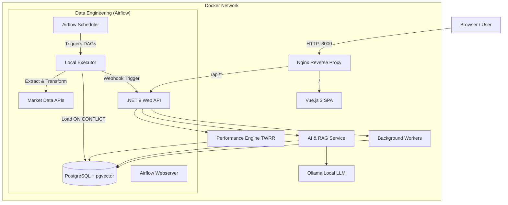

# 📈 ETFInsight: AI-Powered Investment Portfolio Manager

> **A modern financial platform combining rigorous performance analytics (TWRR) with Generative AI (RAG) to provide actionable investment insights.**


---

## 💡 Overview

**ETFInsight** is not just a portfolio tracker. It is a distributed, event-driven system designed to bridge the gap between **Quantitative Finance** and **Semantic AI**.

Most portfolio trackers show you *how much* you have. ETFInsight tells you *why* your portfolio is moving, using a custom-built Financial Engine and a local LLM (Large Language Model) to answer questions like:

- *"Why is my tech exposure risky right now?"*
- *"Find me defensive ETFs similar to this one"*

---

## 🏗️ Architecture

The solution follows **Clean Architecture**, **Domain-Driven Design (DDD)**, and operates within an isolated Docker network using an **API-Gateway / Reverse Proxy** pattern, orchestrated by **Apache Airflow** for robust data pipelines.


---

## 🧩 Key Components
 
 ### Frontend SPA (Vue 3 + TypeScript)
- Responsive, data-rich dashboard styled with Tailwind CSS and shadcn-vue. Served blazingly fast via Nginx.

### Core API (.NET 9)
- Manages portfolios, transactions, and orchestrates the AI workflow. Acts as the brain of the operation.

### Performance Engine
- Implements Time-Weighted Rate of Return (TWRR) to calculate accurate performance regardless of cash flows (deposits/withdrawals). Provides analytics like PnL, drawdowns, peaks, and annualized return.

### AI & Vector Search
- Uses pgvector for semantic search on ETF descriptions and Ollama (Llama 3) for Retrieval Augmented Generation (RAG).

### Data Quality & Event-Driven Workers
- Utilizes Hangfire backed by PostgreSQL to run resilient, asynchronous background jobs (anomaly detection, flash-crash protection).

### Data Engineering & ETL (Apache Airflow)
- Robust data pipelines managed via Directed Acyclic Graphs (DAGs). Handles scheduled End-of-Day (EOD) ingestion, parameterized historical backfills, and triggers asynchronous data quality scans.

---
## 📸 Screenshots

| Dashboard | Portfolio Management |
| :---: | :---: |
|  |  |
| **Transactions & Performance** | **AI Advisor (RAG)** |
|  |  |

### Data Quality Dashboard


---

## 🗺️ Roadmap & Progress

🗺️ Roadmap & Progress
The V1.0 of the project followed a strict 6-Month Architectural Roadmap, which is now fully completed.

### ✅ Phase 1-3: Foundation, Math & AI
- [x] Dockerized environment (Python Scraper + Postgres + .NET API).

- [x] Implementation of TWRR (Time-Weighted Rate of Return) and cash flow handling.

- [x] Integration with Ollama (Local LLM) and pgvector for semantic search.

- [x] RAG pipeline: Chat with your financial data.

### ✅ Phase 4-6: Enterprise Trust, Scale & UI
- [x] Database auditing (time-travel queries via SQL Triggers).

- [x] Anomaly detection (flash-crash protection via Specification Pattern).

- [x] Event-Driven Architecture: Background jobs and retry policies via Hangfire.

- [x] Frontend SPA: Vue 3 + TypeScript dashboard.

- [x] Production Infrastructure: Dockerized multi-stage builds with Nginx Reverse Proxy.

### ✅ Phase 7: Data Engineering (V2 Kickoff)

- [x] Replaced legacy scheduled scripts with Apache Airflow.
      
- [x] Idempotent ETL pipelines (DAGs) for Daily Ingestion and Historical Backfills.


### 🔮 V2 Vision: SaaS & Scale (Upcoming)

- [ ] Multi-Tenancy: Row-Level Security (RLS), Tenant IDs, and user isolation for frictionless onboarding (Guest mode).

- [ ] Just-in-Time (JIT) Ingestion: Airflow DAGs triggered dynamically by .NET API when a user requests a new ticker.
      
- [ ] Scale Ingestion: Implementing Airflow Pools and rate-limiting to safely scale from 50 to 5,000+ ETFs.

- [ ] Automated AI Pipeline: Airflow DAGs to automatically download, parse, and embed PDF Factsheets/KIIDs.


---

## 🚀 Getting Started

### Prerequisites
- **Docker Desktop** (Required)
- **Ollama** installed on host machine (for AI features)

Pull required models:
```bash
ollama pull nomic-embed-text
ollama pull llama3
```

### Installation

1) Clone the repo
```bash
git clone https://github.com/simoneriggi92/ETFInsight.git
cd ETFInsight
```

2) Configure environment  
Ensure your `.env` or `appsettings.json` points to the correct Docker host for Ollama (usually `host.docker.internal:11434`).

3) Run the Platform
```bash
docker-compose up --build -d
```

4) Access the system
- Web App (UI): http://localhost:3000
- Airflow Dashboard: http://localhost:8090
- Hangfire Dashboard: http://localhost:3000/api/hangfire (if exposed via proxy)
- Swagger API: http://localhost:3000/api/swagger
---

## 📄 License
MIT
