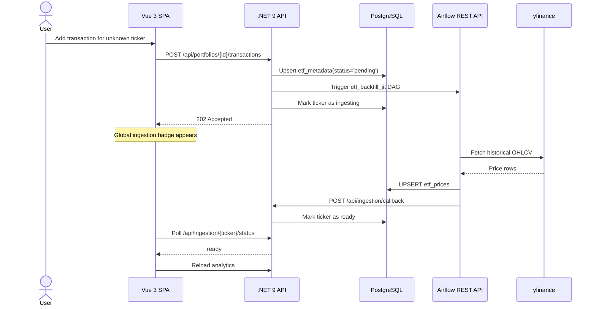
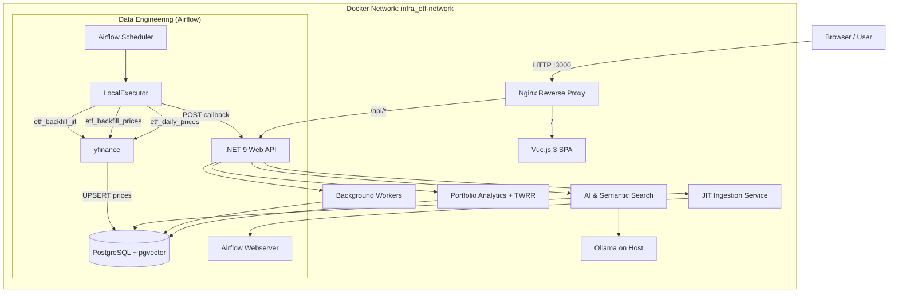
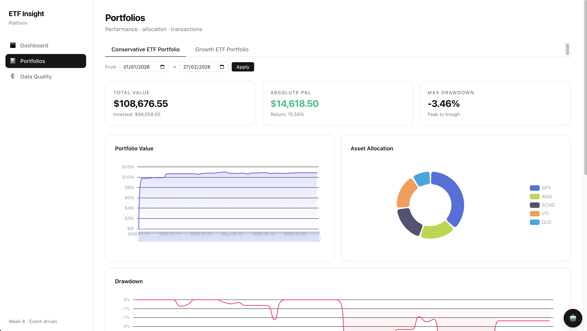
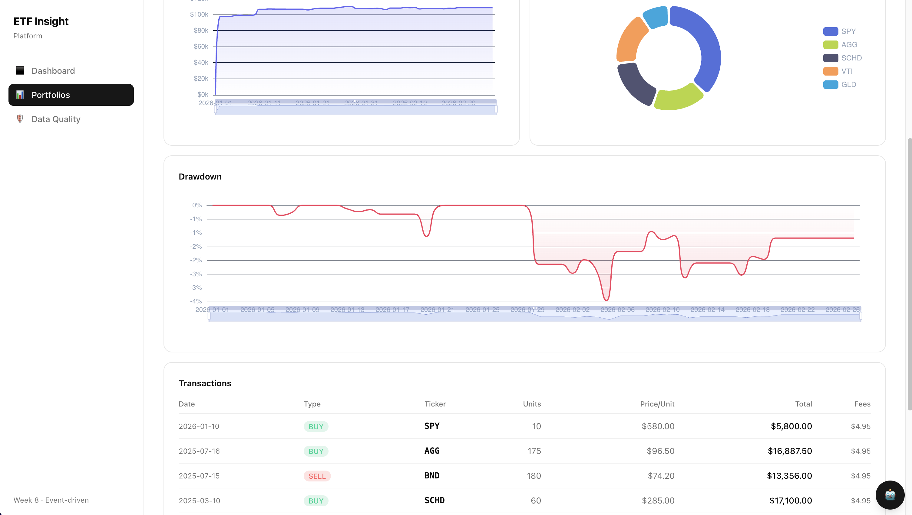
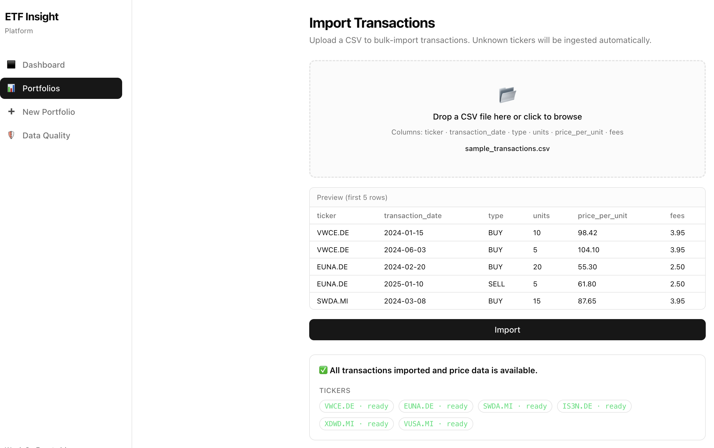
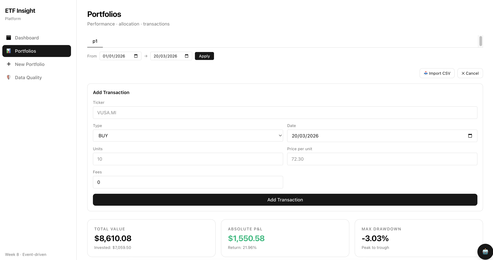

# 📈 ETFInsight: AI-Powered Investment Portfolio Manager

> **A modern financial platform combining rigorous performance analytics (TWRR), local AI (RAG), and Just-in-Time price ingestion to provide actionable investment insights.**


---

## 💡 Overview

**ETFInsight** is not just a portfolio tracker. It is a distributed, event-driven system designed to bridge the gap between **Quantitative Finance** and **Semantic AI**.

Most portfolio trackers show you *how much* you have. ETFInsight aims to tell you *why* your portfolio is moving, using a custom-built analytics engine and a local LLM to answer questions like:

- *"Why is my tech exposure risky right now?"*
- *"Find me defensive ETFs similar to this one"*

V2.0 introduces:

- **guest-session multi-tenancy**
- **Just-in-Time (JIT) ticker ingestion**
- **CSV bulk import**
- **Airflow-orchestrated data pipelines**

This allows a user to create a portfolio and add transactions for almost any ticker without pre-loading thousands of symbols in advance.

---

## 🏗️ Architecture

The solution follows **Clean Architecture** and **Domain-Driven Design (DDD)**, runs inside an isolated Docker network, uses **Nginx** as reverse proxy, **Hangfire** for background jobs, and **Apache Airflow** for data engineering workflows.

### V2.0 — JIT Ingestion Flow



### System Architecture



---

## 🧩 Key Components

### Frontend SPA (Vue 3 + TypeScript + Pinia)

- Responsive dashboard styled with Tailwind CSS and shadcn-vue
- Guest session persisted in `localStorage` and sent via `X-Guest-Id`
- Global ingestion spinner while any ticker is still loading
- CSV import UI with preview and per-ticker ingestion statuses
- AI advisor panel for local RAG queries

### Core API (.NET 9)

| Project                     | Responsibility                                                     |
| --------------------------- | ------------------------------------------------------------------ |
| `EtfInsight.Core`           | Entities, DTOs, domain interfaces, analytics services              |
| `EtfInsight.Infrastructure` | Dapper repositories, Airflow integration, CSV import, Ollama APIs  |
| `EtfInsight.Api`            | Controllers, middleware, DI wiring, runtime orchestration          |
| `EtfInsight.DataQuality`    | Anomaly rules, scanner, settings, persistence contracts            |

### Performance Engine

- Time-Weighted Rate of Return (TWRR)
- Daily valuation history
- PnL and simple return
- Peak and drawdown analytics

### JIT Ingestion Pipeline

When a user submits a transaction for an unknown ticker, the API:

1. creates or updates a placeholder row in `etf_metadata`
2. triggers `etf_backfill_jit` through the Airflow REST API
3. saves the transaction immediately
4. returns `202 Accepted`
5. waits for Airflow to fetch history and POST a signed callback
6. exposes status through `/api/ingestion/{ticker}/status` until the frontend refreshes analytics

### Multi-Tenancy (Guest Sessions)

- No login required
- Each browser gets a UUID guest id
- `GuestSessionMiddleware` resolves and propagates that id
- `portfolios.user_id` and RLS provide tenant separation for portfolio reads

### CSV Bulk Import

- `multipart/form-data` upload
- parsed with `CsvHelper`
- partial-row validation: bad rows are returned, not fatal
- distinct tickers are pushed through the same JIT flow as manual entry

### AI & Vector Search

- Embeddings generated through Ollama
- Stored in Postgres with pgvector
- Similarity search over `etf_documents`
- Answer generation through local Ollama chat/generate APIs

### Data Quality & Event-Driven Workers

- Hangfire-backed scan scheduling
- negative-price rule
- flash-crash rule
- anomaly persistence in `data_anomalies`

### Data Engineering (Apache Airflow)

| DAG                   | Schedule                | Purpose                                     |
| --------------------- | ----------------------- | ------------------------------------------- |
| `etf_daily_prices`    | Daily (EOD)             | Incremental update for active tickers       |
| `etf_backfill_prices` | Manual                  | Historical backfill for a date range        |
| `etf_backfill_jit`    | On-demand               | JIT backfill for a single new ticker        |
| `data_quality_scan`   | Triggered/manual        | Enqueue anomaly scan in the API             |

---

## 📸 Screenshots

|            Dashboard            |          Portfolio Management           |
| :-----------------------------: | :-------------------------------------: |
|     |  |
| **Transactions & Performance** |          **AI Advisor (RAG)** |
|  |            |

### Data Quality Dashboard


|            Portfolio creation            |          Transaction Management           |
| :-----------------------------: | :-------------------------------------: |
|     |  |
| **Transactions & Performance** |          **AI Advisor (RAG)** |
|  |          

---

## 🗺️ Roadmap & Progress

### ✅ Phase 1–3: Foundation, Math & AI

- [x] Dockerized local environment
- [x] TWRR implementation and cash-flow-aware analytics
- [x] Ollama + pgvector integration
- [x] Local RAG pipeline

### ✅ Phase 4–6: Trust, Scale & UI

- [x] Audit table for ETF price changes
- [x] Rule-based anomaly detection
- [x] Hangfire background jobs
- [x] Vue 3 + TypeScript SPA
- [x] Dockerized frontend + API deployment

### ✅ Phase 7: Data Engineering

- [x] Replaced legacy scheduled scripts with Airflow
- [x] Daily and backfill DAGs with idempotent upserts

### ✅ Phase 8: JIT Ingestion & Guest Sessions

- [x] `user_id` guest-session tenancy model
- [x] `etf_ingestion_status` lifecycle in `etf_metadata`
- [x] API-triggered `etf_backfill_jit` DAG
- [x] Signed ingestion callback endpoint
- [x] Frontend polling and auto-refresh
- [x] CSV import integrated with JIT flow

### 🔮 Next Steps

- [ ] Airflow pools and rate-limiting for larger ticker volumes
- [ ] Automated PDF factsheet/KIID ingestion and embedding
- [ ] JIT smoke test covering create portfolio → add unknown ticker → poll until ready
- [ ] Stronger tenant isolation across all data paths
- [ ] Full multi-currency valuation support

---

## 🚀 Getting Started

### Prerequisites

- **Docker Desktop**
- **Ollama** running on the host machine

Pull the required models:

```bash
ollama pull nomic-embed-text
ollama pull llama3.2
```

### Installation

```bash
git clone https://github.com/simoneriggi92/ETFInsight.git
cd ETFInsight/infra
docker compose up --build -d
```

---

## 🔧 Configuration Notes

### Ollama

The API container expects Ollama to be reachable at:

```text
http://host.docker.internal:11434
```

That is already wired in `infra/docker-compose.yml`.

### Airflow Callback URL

There are two common development modes:

#### 1. Full Docker mode

API and Airflow both run inside Docker. In this mode, Airflow should callback:

```text
http://etf-api:8080/api/ingestion/callback
```

#### 2. API on host, Airflow in Docker

If you run the API locally with `dotnet run`, Airflow cannot call `etf-api:8080`.  
In that case, set:

```text
DOTNET_API_CALLBACK_URL=http://host.docker.internal:5001/api/ingestion/callback
```

This is the most important setup detail for local JIT ingestion debugging.

### Airflow/Auth variables currently used by the stack

| Variable                                  | Service   | Description                                        |
| ----------------------------------------- | --------- | -------------------------------------------------- |
| `Airflow__BaseUrl`                        | `etf_api` | Airflow webserver URL used by the API              |
| `Airflow__Username` / `Airflow__Password` | `etf_api` | Airflow Basic Auth credentials                     |
| `Airflow__CallbackSecret`                 | `etf_api` | Shared secret expected by `/api/ingestion/callback`|
| `DOTNET_API_CALLBACK_URL`                 | Airflow   | Callback target for `etf_backfill_jit`             |
| `AIRFLOW_CALLBACK_SECRET`                 | Airflow   | Shared secret sent by the DAG callback             |

---

## 🌐 Access Points

| Service            | URL                                   |
| ------------------ | ------------------------------------- |
| Web App            | http://localhost:3000                 |
| Airflow Dashboard  | http://localhost:8090                 |
| API Swagger UI     | http://localhost:5001                 |
| API Health         | http://localhost:5001/health          |
| Hangfire Dashboard | http://localhost:5001/hangfire        |

Note: Swagger is exposed directly by the API container in development mode. It is not the same as the frontend route space under port `3000`.

---

## 🧪 CSV Import

A sample CSV is available at [`docs/jit ingestion/csv_import/sample_transactions.csv`](./jit%20ingestion/csv_import/sample_transactions.csv).

Expected columns:

```csv
ticker,transaction_date,type,units,price_per_unit,fees
VWCE.DE,2024-01-15,BUY,10,98.42,3.95
```

---

## 🛠️ Troubleshooting

### `etf_api` starts but JIT ingestion never completes

Check:

- `etf-postgres` is healthy
- `etf-airflow-webserver` is reachable
- `etf-airflow-scheduler` is running
- `DOTNET_API_CALLBACK_URL` matches your dev mode
- `AIRFLOW_CALLBACK_SECRET` matches `Airflow__CallbackSecret`

Useful commands:

```bash
docker compose ps
docker logs etf-api
docker logs etf-postgres
docker logs etf-airflow-webserver
docker logs etf-airflow-scheduler
```

### API works but the container shows as unhealthy

If the API responds but Docker still marks the container unhealthy, inspect the healthcheck command in `infra/docker-compose.yml` and the runtime image tooling. A mismatched healthcheck can make the container appear unhealthy even when the app process is alive.

---

## 📄 License

MIT
