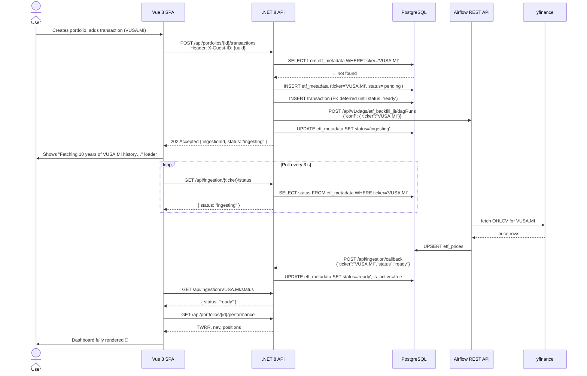
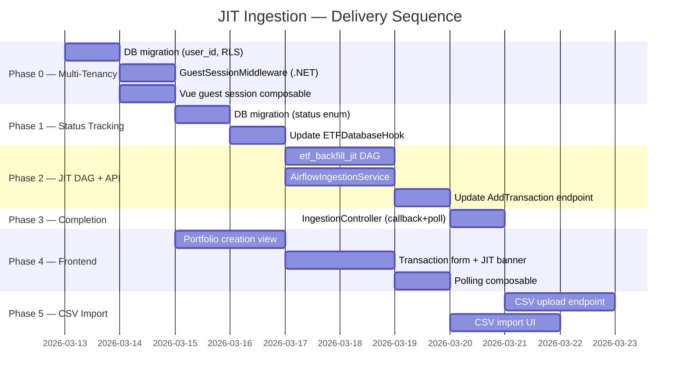

# JIT Ingestion — Architecture & Implementation Plan

> **Goal**: allow any user to create a portfolio, submit transactions for _any_ ticker, and have the
> platform automatically download the missing ETF price history on demand — all without pre-loading
> thousands of symbols nobody will ever use.

---

## Table of Contents

1. [Why JIT?](#1-why-jit)
2. [High-Level Architecture](#2-high-level-architecture)
3. [Phase 0 — Multi-Tenancy Foundations (DB + Auth)](#3-phase-0--multi-tenancy-foundations)
4. [Phase 1 — ETF Status Tracking](#4-phase-1--etf-status-tracking)
5. [Phase 2 — JIT Trigger on Transaction Submit](#5-phase-2--jit-trigger-on-transaction-submit)
6. [Phase 3 — Completion Notification & Polling](#6-phase-3--completion-notification--polling)
7. [Phase 4 — Frontend (Vue.js)](#7-phase-4--frontend-vuejs)
8. [Phase 5 — CSV Bulk Import](#8-phase-5--csv-bulk-import)
9. [Edge Cases & Error Handling](#9-edge-cases--error-handling)
10. [Implementation Sequence](#10-implementation-sequence)
11. [Todo List](#11-todo-list)

---

## 11. Todo List

> Ordered by delivery sequence. Each task can be picked up independently within its phase.
> Legend: `[ ]` not started · `[~]` in progress · `[x]` done

### Phase 0 — Multi-Tenancy Foundations

#### 0.1 Database

- [x] **0.1.1** Write migration `07_multi_tenancy.sql`
  - Add `user_id UUID` column to `portfolios` (nullable, no default — preserves seed data)
  - Create index `idx_portfolios_user_id`
- [x] **0.1.2** Write RLS policies in the same migration (or `07b_rls.sql`)
  - `ALTER TABLE portfolios ENABLE ROW LEVEL SECURITY`
  - Create policy `portfolios_tenant_isolation` scoped to `current_setting('app.user_id')`
  - Document how to disable RLS for superuser migrations
- [x] **0.1.3** Apply migration against local Docker Postgres; verify seed portfolios still load

#### 0.2 .NET API — Guest Session

- [x] **0.2.1** Create `Middleware/GuestSessionMiddleware.cs`
  - Read `X-Guest-ID` header; parse as `Guid`; fall back to a new `Guid.NewGuid()` if absent
  - Store resolved id in `HttpContext.Items`
- [x] **0.2.2** Create `Extensions/HttpContextExtensions.cs` with `GetGuestId()` helper
- [x] **0.2.3** Register middleware in `Program.cs` (before routing)
- [x] **0.2.4** Add `SetTenantContextAsync` helper to `DapperPortfolioRepository` that calls
      `set_config('app.user_id', …)` before every query
- [x] **0.2.5** Update `PortfoliosController.Create` to persist `user_id` from middleware
- [x] **0.2.6** Update `PortfoliosController.GetAll` / `GetById` to filter by `user_id`
- [x] **0.2.7** Write unit tests for middleware (missing header → auto-generate, invalid UUID →
      auto-generate, valid UUID → reused)

#### 0.3 Frontend — Guest Session

- [x] **0.3.1** Create `src/composables/useGuestSession.ts`
  - Generate UUID via `crypto.randomUUID()` on first visit; persist in `localStorage`
  - Export reactive `guestId` ref
- [x] **0.3.2** Update `src/api/client.ts` Axios instance to attach `X-Guest-ID` header via
      request interceptor

---

### Phase 1 — ETF Status Tracking

#### 1.1 Database

- [x] **1.1.1** Write migration `08_etf_ingestion_status.sql`
  - Create `etf_ingestion_status` enum: `unknown`, `pending`, `ingesting`, `ready`, `error`
  - Add columns to `etf_metadata`: `status`, `ingestion_requested_at`, `ingestion_completed_at`,
    `ingestion_error`
  - `UPDATE etf_metadata SET status = 'ready' WHERE is_active = true` (backfill)
- [x] **1.1.2** Apply migration; confirm existing tickers show `status = 'ready'`

#### 1.2 Airflow — ETFDatabaseHook

- [x] **1.2.1** Add `upsert_etf_metadata(ticker, status)` method to `ETFDatabaseHook`
  - Used by `etf_backfill_jit` to update status at the end of a run
- [x] **1.2.2** Add `get_ticker_status(ticker) → str` method for potential DAG-side checks

---

### Phase 2 — JIT Trigger on Transaction Submit

#### 2.1 Airflow — `etf_backfill_jit` DAG

- [x] **2.1.1** Create `airflow/dags/etf_jit_ingest.py`
  - DAG params: `ticker` (required), `date_from` (default `2015-01-01`), `date_to` (default today)
  - Task `fetch_and_load`: call existing `fetch_raw_prices_range` → `normalize_prices` →
    `validate_prices` → `hook.upsert_prices()`
  - Task `notify_api`: POST to `DOTNET_API_CALLBACK_URL` env var with `{"ticker", "status": "ready"}`
  - `on_failure_callback`: set `status = 'error'` in `etf_metadata` via hook
  - Set `max_active_runs=10` to allow parallel ingestions
- [x] **2.1.2** Add `DOTNET_API_CALLBACK_URL` to `docker-compose.yml` Airflow service env
- [x] **2.1.3** Manually trigger DAG for a test ticker (e.g. `VWCE.DE`) from Airflow UI; confirm
      prices land in `etf_prices` and `status` flips to `ready`

#### 2.2 .NET API — `AirflowIngestionService`

- [x] **2.2.1** Add `IIngestionService` interface to `EtfInsight.Core/Interfaces/`
  - Single method: `Task<IngestionStatus> EnsureTickerReadyAsync(string ticker, CancellationToken ct)`
- [x] **2.2.2** Add `IngestionStatus` enum (`Ready`, `Ingesting`, `Error`) to `EtfInsight.Core`
- [x] **2.2.3** Create `Infrastructure/Services/AirflowIngestionService.cs`
  - Reads `Airflow:BaseUrl`, `Airflow:Username`, `Airflow:Password` from `IConfiguration`
  - Upserts `etf_metadata` placeholder row (`status='pending'`) before triggering DAG
  - POSTs to Airflow REST API `/api/v1/dags/etf_backfill_jit/dagRuns` with Basic auth
  - Sets `status='ingesting'` on success, `status='error'` on HTTP failure
  - Guards against duplicate triggers via `ON CONFLICT DO NOTHING`
- [x] **2.2.4** Add Airflow config section to `appsettings.Development.json`
- [x] **2.2.5** Register `IIngestionService` → `AirflowIngestionService` as scoped in `Program.cs`
- [x] **2.2.6** Register named `HttpClient("Airflow")` in `Program.cs`

#### 2.3 .NET API — Update `PortfoliosController.AddTransaction`

- [x] **2.3.1** Inject `IIngestionService` into `PortfoliosController`
- [x] **2.3.2** Before inserting the transaction, call `EnsureTickerReadyAsync(ticker)`
- [x] **2.3.3** Return `201 Created` if status is `ready`; return `202 Accepted` with ingestion
      metadata if status is `ingesting`
- [x] **2.3.4** Write integration test: submit transaction for unknown ticker → expect `202` +
      `etf_metadata` row with `status='ingesting'` or `'pending'`

---

### Phase 3 — Completion Notification & Polling

#### 3.1 .NET API — `IngestionController`

- [x] **3.1.1** Create `Controllers/IngestionController.cs`
  - `POST /api/ingestion/callback` — called by Airflow; updates `etf_metadata.status`
  - `GET /api/ingestion/{ticker}/status` — polled by frontend; returns status row
- [x] **3.1.2** Add `IngestionCallbackRequest` record (Ticker, Status, Error?, DagRunId?)
- [x] **3.1.3** Secure the callback endpoint: validate a shared secret header
      (`X-Callback-Secret`) to prevent spoofing; store secret in `appsettings` / env var
- [x] **3.1.4** Write unit tests for both endpoints (happy path + unknown ticker 404)

---

### Phase 4 — Frontend (Vue.js)

#### 4.1 Portfolio Management

- [x] **4.1.1** Create `src/api/portfolios.ts` with `createPortfolio`, `getPortfolio`,
      `listPortfolios` functions
- [x] **4.1.2** Create `src/views/PortfolioCreateView.vue`
  - Form fields: name, base currency (EUR/USD/GBP)
  - On success, redirect to `PortfolioDashboardView`
- [x] **4.1.3** Create `src/views/PortfolioDashboardView.vue`
  - List positions, show TWRR (disabled/skeleton when ingestion is pending)
  - "Add Transaction" CTA button
- [x] **4.1.4** Add routes to `src/router/index.ts`:
      `/portfolios/new`, `/portfolios/:id`, `/portfolios/:id/add-transaction`

#### 4.2 Transaction Form + JIT Banner

- [x] **4.2.1** Create `src/components/AddTransactionForm.vue`
  - Fields: ticker, date, type (BUY/SELL), units, price per unit, fees, currency
  - Client-side validation (non-empty ticker, positive numbers, valid date)
- [x] **4.2.2** Implement JIT status banner inside the form component
  - `ingesting` state: spinner + friendly message
  - `error` state: error message + "Retry" button that re-submits the transaction
- [x] **4.2.3** Create `src/composables/useIngestionPolling.ts`
  - Poll `GET /api/ingestion/{ticker}/status` every 3 s
  - Auto-stop on `ready` or `error`; clean up interval on component unmount
- [x] **4.2.4** Create `src/views/AddTransactionView.vue` that wraps the form component and wires
      polling composable

#### 4.3 UX Polish

- [x] **4.3.1** Add a global "My Portfolios" nav link visible on all pages
- [x] **4.3.2** Show a subtle persistent badge (e.g. 🔄 spinner) in the nav/portfolio header when
      any ticker is still ingesting
- [x] **4.3.3** Auto-refresh the dashboard TWRR section once the last pending ticker transitions to
      `ready`

---

### Phase 5 — CSV Bulk Import

#### 5.1 .NET API

- [x] **5.1.1** Add `CsvHelper` NuGet package to `EtfInsight.Api.csproj`
- [x] **5.1.2** Define `TransactionCsvRow` record mapping CSV columns
      (ticker, transaction_date, type, units, price_per_unit, fees, currency)
- [x] **5.1.3** Create `POST /api/portfolios/{id}/transactions/import` endpoint
  - Accept `multipart/form-data` with a CSV file
  - Parse, de-duplicate tickers, call `EnsureTickerReadyAsync` in parallel for all unknowns
  - Bulk-insert valid rows via `BulkAddTransactionsAsync`
  - Return `202` if any ticker is still ingesting; `200` if all are ready
- [x] **5.1.4** Add `BulkAddTransactionsAsync` to `IPortfolioRepository` + Dapper implementation
      (use `COPY` or batched `INSERT`)
- [x] **5.1.5** Validate CSV rows server-side; return structured error list for invalid rows
      (don't fail the whole import for one bad row)
- [x] **5.1.6** Write integration tests: valid CSV, CSV with unknown tickers, CSV with bad rows

#### 5.2 Frontend

- [x] **5.2.1** Create `src/components/CsvImportDropzone.vue`
  - Drag-and-drop or file-picker for CSV
  - Client-side preview of parsed rows before submit (using `papaparse`)
- [x] **5.2.2** Create `src/views/CsvImportView.vue`
  - Embed `CsvImportDropzone`
  - After submit, show per-ticker ingestion status (table with status badges)
  - Poll ingestion status for each pending ticker independently
- [x] **5.2.3** Add route `/portfolios/:id/import` and nav link "Import CSV" on the dashboard

---

### Cross-Cutting Tasks

- [ ] **X.1** Update `README.md` with JIT feature overview and local dev setup notes for
      the Airflow callback URL
- [ ] **X.2** Add `AIRFLOW_API_URL`, `AIRFLOW_USER`, `AIRFLOW_PASS`, `CALLBACK_SECRET` env vars to
      `infra/docker-compose.yml` with safe development defaults
- [ ] **X.3** Update `src/db/schema.md` to document the new `status` column and RLS policies
- [ ] **X.4** Add E2E smoke test: create portfolio → add unknown ticker transaction → poll until
      `ready` → verify TWRR is non-null

---

## 1. Why JIT?

Pre-loading all ~5 000 ETFs wastes storage, CPU, and API quota.
Real traffic follows a power-law: 20 % of tickers (VWCE, SWDA, SPY, QQQ…) account for 80 %+ of
user demand. JIT ingestion means:

- **Zero wasted downloads** — data is fetched only when a real user requests it.
- **Instant cold-start** — new deployments work without any pre-seeding.
- **Natural rate-limit compliance** — only genuinely needed tickers ever hit yfinance.
- **Organic cache growth** — popular tickers become instantly available for the next user.

---

## 2. High-Level Architecture

---

## 3. Edge Cases & Error Handling

| Scenario                                                  | Handling                                                                                                                        |
| --------------------------------------------------------- | ------------------------------------------------------------------------------------------------------------------------------- |
| **Ticker doesn't exist on yfinance**                      | DAG sets `status='error'`; API surfaces error to frontend; user can correct the ticker                                          |
| **User submits same unknown ticker twice simultaneously** | `INSERT ... ON CONFLICT DO NOTHING` + `status = 'ingesting'` guard prevents duplicate DAG runs                                  |
| **Airflow is down**                                       | `EnsureTickerReadyAsync` catches HTTP failure, sets `status='error'`; transaction is still saved; cron can retry                |
| **User closes browser mid-ingestion**                     | Data is safe in DB; next page load re-polls `/api/ingestion/{ticker}/status`                                                    |
| **Partial backfill** (yfinance returns incomplete data)   | Existing `validate_prices` rejects invalid rows; partial data is still loaded; status = 'ready' with whatever data is available |
| **Security: tenant isolation**                            | `user_id` check in every repository query + optional RLS; no user can query another user's portfolios                           |
| **Rate limiting yfinance**                                | `etf_backfill_jit` DAG has `retries=2` with backoff; for heavy load, ticketing a Celery queue is the next step                  |

---

## 4. Implementation Sequence

### Priority order

1. **[DB]** Migrations `07_multi_tenancy.sql` + `08_etf_ingestion_status.sql`
2. **[API]** `GuestSessionMiddleware` + `AirflowIngestionService`
3. **[Airflow]** `etf_backfill_jit` DAG
4. **[API]** `IngestionController` (callback + status poll endpoints)
5. **[API]** Update `PortfoliosController.AddTransaction` to call `IIngestionService`
6. **[Vue]** Guest session composable + Axios interceptor
7. **[Vue]** Portfolio creation view + transaction form with JIT banner
8. **[Vue]** CSV import view
