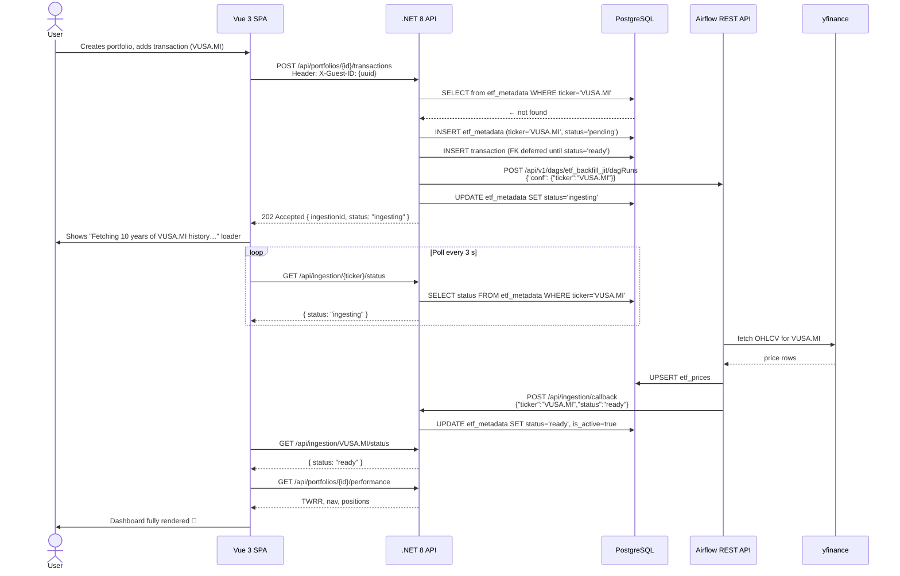
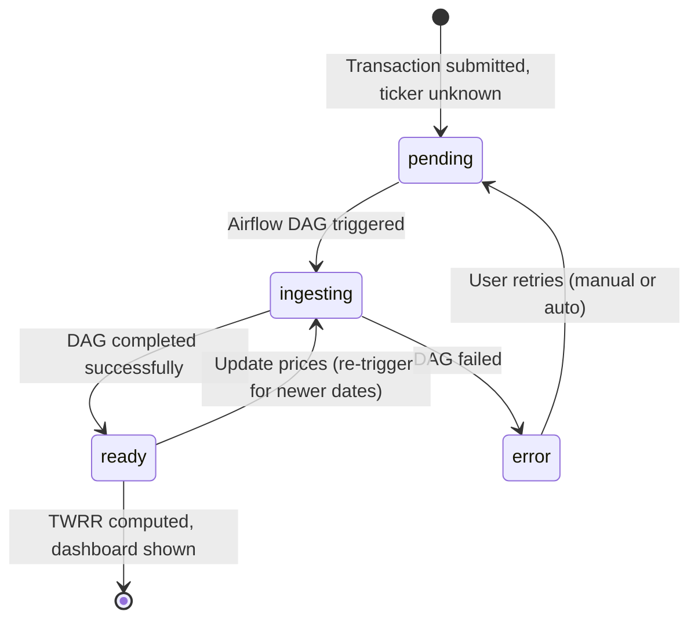
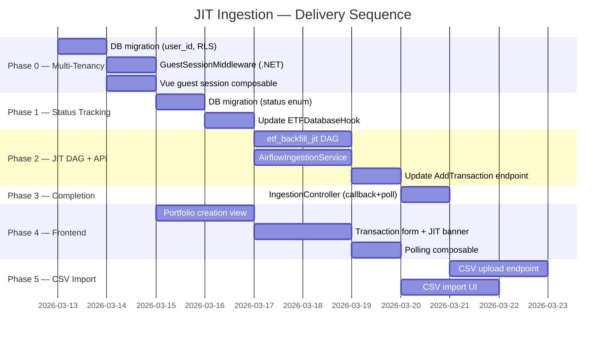

# JIT Ingestion — Architecture & Implementation Plan

> **Goal**: allow any user to create a portfolio, submit transactions for _any_ ticker, and have the
> platform automatically download the missing ETF price history on demand — all without pre-loading
> thousands of symbols nobody will ever use.

---

## Table of Contents

1. [Why JIT?](#1-why-jit)
2. [High-Level Architecture](#2-high-level-architecture)
3. [Phase 0 — Multi-Tenancy Foundations (DB + Auth)](#3-phase-0--multi-tenancy-foundations)
4. [Phase 1 — ETF Status Tracking](#4-phase-1--etf-status-tracking)
5. [Phase 2 — JIT Trigger on Transaction Submit](#5-phase-2--jit-trigger-on-transaction-submit)
6. [Phase 3 — Completion Notification & Polling](#6-phase-3--completion-notification--polling)
7. [Phase 4 — Frontend (Vue.js)](#7-phase-4--frontend-vuejs)
8. [Phase 5 — CSV Bulk Import](#8-phase-5--csv-bulk-import)
9. [Edge Cases & Error Handling](#9-edge-cases--error-handling)
10. [Implementation Sequence](#10-implementation-sequence)
11. [Todo List](#11-todo-list)

---

## 11. Todo List

> Ordered by delivery sequence. Each task can be picked up independently within its phase.
> Legend: `[ ]` not started · `[~]` in progress · `[x]` done

### Phase 0 — Multi-Tenancy Foundations

#### 0.1 Database

- [x] **0.1.1** Write migration `07_multi_tenancy.sql`
  - Add `user_id UUID` column to `portfolios` (nullable, no default — preserves seed data)
  - Create index `idx_portfolios_user_id`
- [x] **0.1.2** Write RLS policies in the same migration (or `07b_rls.sql`)
  - `ALTER TABLE portfolios ENABLE ROW LEVEL SECURITY`
  - Create policy `portfolios_tenant_isolation` scoped to `current_setting('app.user_id')`
  - Document how to disable RLS for superuser migrations
- [x] **0.1.3** Apply migration against local Docker Postgres; verify seed portfolios still load

#### 0.2 .NET API — Guest Session

- [x] **0.2.1** Create `Middleware/GuestSessionMiddleware.cs`
  - Read `X-Guest-ID` header; parse as `Guid`; fall back to a new `Guid.NewGuid()` if absent
  - Store resolved id in `HttpContext.Items`
- [x] **0.2.2** Create `Extensions/HttpContextExtensions.cs` with `GetGuestId()` helper
- [x] **0.2.3** Register middleware in `Program.cs` (before routing)
- [x] **0.2.4** Add `SetTenantContextAsync` helper to `DapperPortfolioRepository` that calls
      `set_config('app.user_id', …)` before every query
- [x] **0.2.5** Update `PortfoliosController.Create` to persist `user_id` from middleware
- [x] **0.2.6** Update `PortfoliosController.GetAll` / `GetById` to filter by `user_id`
- [x] **0.2.7** Write unit tests for middleware (missing header → auto-generate, invalid UUID →
      auto-generate, valid UUID → reused)

#### 0.3 Frontend — Guest Session

- [x] **0.3.1** Create `src/composables/useGuestSession.ts`
  - Generate UUID via `crypto.randomUUID()` on first visit; persist in `localStorage`
  - Export reactive `guestId` ref
- [x] **0.3.2** Update `src/api/client.ts` Axios instance to attach `X-Guest-ID` header via
      request interceptor

---

### Phase 1 — ETF Status Tracking

#### 1.1 Database

- [x] **1.1.1** Write migration `08_etf_ingestion_status.sql`
  - Create `etf_ingestion_status` enum: `unknown`, `pending`, `ingesting`, `ready`, `error`
  - Add columns to `etf_metadata`: `status`, `ingestion_requested_at`, `ingestion_completed_at`,
    `ingestion_error`
  - `UPDATE etf_metadata SET status = 'ready' WHERE is_active = true` (backfill)
- [x] **1.1.2** Apply migration; confirm existing tickers show `status = 'ready'`

#### 1.2 Airflow — ETFDatabaseHook

- [x] **1.2.1** Add `upsert_etf_metadata(ticker, status)` method to `ETFDatabaseHook`
  - Used by `etf_backfill_jit` to update status at the end of a run
- [x] **1.2.2** Add `get_ticker_status(ticker) → str` method for potential DAG-side checks

---

### Phase 2 — JIT Trigger on Transaction Submit

#### 2.1 Airflow — `etf_backfill_jit` DAG

- [x] **2.1.1** Create `airflow/dags/etf_jit_ingest.py`
  - DAG params: `ticker` (required), `date_from` (default `2015-01-01`), `date_to` (default today)
  - Task `fetch_and_load`: call existing `fetch_raw_prices_range` → `normalize_prices` →
    `validate_prices` → `hook.upsert_prices()`
  - Task `notify_api`: POST to `DOTNET_API_CALLBACK_URL` env var with `{"ticker", "status": "ready"}`
  - `on_failure_callback`: set `status = 'error'` in `etf_metadata` via hook
  - Set `max_active_runs=10` to allow parallel ingestions
- [x] **2.1.2** Add `DOTNET_API_CALLBACK_URL` to `docker-compose.yml` Airflow service env
- [x] **2.1.3** Manually trigger DAG for a test ticker (e.g. `VWCE.DE`) from Airflow UI; confirm
      prices land in `etf_prices` and `status` flips to `ready`

#### 2.2 .NET API — `AirflowIngestionService`

- [x] **2.2.1** Add `IIngestionService` interface to `EtfInsight.Core/Interfaces/`
  - Single method: `Task<IngestionStatus> EnsureTickerReadyAsync(string ticker, CancellationToken ct)`
- [x] **2.2.2** Add `IngestionStatus` enum (`Ready`, `Ingesting`, `Error`) to `EtfInsight.Core`
- [x] **2.2.3** Create `Infrastructure/Services/AirflowIngestionService.cs`
  - Reads `Airflow:BaseUrl`, `Airflow:Username`, `Airflow:Password` from `IConfiguration`
  - Upserts `etf_metadata` placeholder row (`status='pending'`) before triggering DAG
  - POSTs to Airflow REST API `/api/v1/dags/etf_backfill_jit/dagRuns` with Basic auth
  - Sets `status='ingesting'` on success, `status='error'` on HTTP failure
  - Guards against duplicate triggers via `ON CONFLICT DO NOTHING`
- [x] **2.2.4** Add Airflow config section to `appsettings.Development.json`
- [x] **2.2.5** Register `IIngestionService` → `AirflowIngestionService` as scoped in `Program.cs`
- [x] **2.2.6** Register named `HttpClient("Airflow")` in `Program.cs`

#### 2.3 .NET API — Update `PortfoliosController.AddTransaction`

- [ ] **2.3.1** Inject `IIngestionService` into `PortfoliosController`
- [ ] **2.3.2** Before inserting the transaction, call `EnsureTickerReadyAsync(ticker)`
- [ ] **2.3.3** Return `201 Created` if status is `ready`; return `202 Accepted` with ingestion
      metadata if status is `ingesting`
- [ ] **2.3.4** Write integration test: submit transaction for unknown ticker → expect `202` +
      `etf_metadata` row with `status='ingesting'` or `'pending'`

---

### Phase 3 — Completion Notification & Polling

#### 3.1 .NET API — `IngestionController`

- [ ] **3.1.1** Create `Controllers/IngestionController.cs`
  - `POST /api/ingestion/callback` — called by Airflow; updates `etf_metadata.status`
  - `GET /api/ingestion/{ticker}/status` — polled by frontend; returns status row
- [ ] **3.1.2** Add `IngestionCallbackRequest` record (Ticker, Status, Error?, DagRunId?)
- [ ] **3.1.3** Secure the callback endpoint: validate a shared secret header
      (`X-Callback-Secret`) to prevent spoofing; store secret in `appsettings` / env var
- [ ] **3.1.4** Write unit tests for both endpoints (happy path + unknown ticker 404)

---

### Phase 4 — Frontend (Vue.js)

#### 4.1 Portfolio Management

- [ ] **4.1.1** Create `src/api/portfolios.ts` with `createPortfolio`, `getPortfolio`,
      `listPortfolios` functions
- [ ] **4.1.2** Create `src/views/PortfolioCreateView.vue`
  - Form fields: name, base currency (EUR/USD/GBP)
  - On success, redirect to `PortfolioDashboardView`
- [ ] **4.1.3** Create `src/views/PortfolioDashboardView.vue`
  - List positions, show TWRR (disabled/skeleton when ingestion is pending)
  - "Add Transaction" CTA button
- [ ] **4.1.4** Add routes to `src/router/index.ts`:
      `/portfolios/new`, `/portfolios/:id`, `/portfolios/:id/add-transaction`

#### 4.2 Transaction Form + JIT Banner

- [ ] **4.2.1** Create `src/components/AddTransactionForm.vue`
  - Fields: ticker, date, type (BUY/SELL), units, price per unit, fees, currency
  - Client-side validation (non-empty ticker, positive numbers, valid date)
- [ ] **4.2.2** Implement JIT status banner inside the form component
  - `ingesting` state: spinner + friendly message
  - `error` state: error message + "Retry" button that re-submits the transaction
- [ ] **4.2.3** Create `src/composables/useIngestionPolling.ts`
  - Poll `GET /api/ingestion/{ticker}/status` every 3 s
  - Auto-stop on `ready` or `error`; clean up interval on component unmount
- [ ] **4.2.4** Create `src/views/AddTransactionView.vue` that wraps the form component and wires
      polling composable

#### 4.3 UX Polish

- [ ] **4.3.1** Add a global "My Portfolios" nav link visible on all pages
- [ ] **4.3.2** Show a subtle persistent badge (e.g. 🔄 spinner) in the nav/portfolio header when
      any ticker is still ingesting
- [ ] **4.3.3** Auto-refresh the dashboard TWRR section once the last pending ticker transitions to
      `ready`

---

### Phase 5 — CSV Bulk Import

#### 5.1 .NET API

- [ ] **5.1.1** Add `CsvHelper` NuGet package to `EtfInsight.Api.csproj`
- [ ] **5.1.2** Define `TransactionCsvRow` record mapping CSV columns
      (ticker, transaction_date, type, units, price_per_unit, fees, currency)
- [ ] **5.1.3** Create `POST /api/portfolios/{id}/transactions/import` endpoint
  - Accept `multipart/form-data` with a CSV file
  - Parse, de-duplicate tickers, call `EnsureTickerReadyAsync` in parallel for all unknowns
  - Bulk-insert valid rows via `BulkAddTransactionsAsync`
  - Return `202` if any ticker is still ingesting; `200` if all are ready
- [ ] **5.1.4** Add `BulkAddTransactionsAsync` to `IPortfolioRepository` + Dapper implementation
      (use `COPY` or batched `INSERT`)
- [ ] **5.1.5** Validate CSV rows server-side; return structured error list for invalid rows
      (don't fail the whole import for one bad row)
- [ ] **5.1.6** Write integration tests: valid CSV, CSV with unknown tickers, CSV with bad rows

#### 5.2 Frontend

- [ ] **5.2.1** Create `src/components/CsvImportDropzone.vue`
  - Drag-and-drop or file-picker for CSV
  - Client-side preview of parsed rows before submit (using `papaparse`)
- [ ] **5.2.2** Create `src/views/CsvImportView.vue`
  - Embed `CsvImportDropzone`
  - After submit, show per-ticker ingestion status (table with status badges)
  - Poll ingestion status for each pending ticker independently
- [ ] **5.2.3** Add route `/portfolios/:id/import` and nav link "Import CSV" on the dashboard

---

### Cross-Cutting Tasks

- [ ] **X.1** Update `README.md` with JIT feature overview and local dev setup notes for
      the Airflow callback URL
- [ ] **X.2** Add `AIRFLOW_API_URL`, `AIRFLOW_USER`, `AIRFLOW_PASS`, `CALLBACK_SECRET` env vars to
      `infra/docker-compose.yml` with safe development defaults
- [ ] **X.3** Update `src/db/schema.md` to document the new `status` column and RLS policies
- [ ] **X.4** Add E2E smoke test: create portfolio → add unknown ticker transaction → poll until
      `ready` → verify TWRR is non-null

---

## 1. Why JIT?

Pre-loading all ~5 000 ETFs wastes storage, CPU, and API quota.
Real traffic follows a power-law: 20 % of tickers (VWCE, SWDA, SPY, QQQ…) account for 80 %+ of
user demand. JIT ingestion means:

- **Zero wasted downloads** — data is fetched only when a real user requests it.
- **Instant cold-start** — new deployments work without any pre-seeding.
- **Natural rate-limit compliance** — only genuinely needed tickers ever hit yfinance.
- **Organic cache growth** — popular tickers become instantly available for the next user.

---

## 2. High-Level Architecture



---

## 3. Phase 0 — Multi-Tenancy Foundations

### 3.1 Database — add `user_id` to `portfolios`

We use a lightweight _guest-token_ model: the browser generates a UUID once and sends it as a
header. No email/password required at this stage.

```sql
-- Migration: 07_multi_tenancy.sql

-- Add owner column to portfolios (nullable for backward compat with seed data)
ALTER TABLE portfolios
    ADD COLUMN IF NOT EXISTS user_id UUID;

CREATE INDEX IF NOT EXISTS idx_portfolios_user_id ON portfolios(user_id);

-- Transactions are already isolated via portfolio_id FK cascade — no change needed.
```

### 3.2 Row-Level Security (RLS) — optional but recommended

RLS makes data isolation bulletproof at the DB engine level, even if the API has a bug.

```sql
-- Enable RLS
ALTER TABLE portfolios ENABLE ROW LEVEL SECURITY;
ALTER TABLE portfolios FORCE ROW LEVEL SECURITY;

-- Policy: a session can only see portfolios that belong to its app.user_id setting
CREATE POLICY portfolios_tenant_isolation ON portfolios
    USING (user_id = current_setting('app.user_id')::uuid);
```

In the .NET API, set the session variable before every query:

```csharp
// Infrastructure/Repositories/DapperPortfolioRepository.cs

private async Task SetTenantContextAsync(Guid userId)
{
    await _db.ExecuteAsync(
        "SELECT set_config('app.user_id', @UserId, true)",   // true = local to transaction
        new { UserId = userId.ToString() });
}
```

### 3.3 .NET API — Guest Session Middleware

```csharp
// Middleware/GuestSessionMiddleware.cs

public class GuestSessionMiddleware(RequestDelegate next)
{
    public const string GuestIdKey = "GuestUserId";

    public async Task InvokeAsync(HttpContext ctx)
    {
        if (ctx.Request.Headers.TryGetValue("X-Guest-ID", out var raw)
            && Guid.TryParse(raw, out var guestId))
        {
            ctx.Items[GuestIdKey] = guestId;
        }
        else
        {
            // Auto-generate; client should persist and re-send it
            ctx.Items[GuestIdKey] = Guid.NewGuid();
        }
        await next(ctx);
    }
}
```

Register in `Program.cs`:

```csharp
app.UseMiddleware<GuestSessionMiddleware>();
```

Inject via a simple extension so controllers stay clean:

```csharp
// Extensions/HttpContextExtensions.cs

public static Guid GetGuestId(this HttpContext ctx)
    => ctx.Items.TryGetValue(GuestSessionMiddleware.GuestIdKey, out var v) && v is Guid g
        ? g
        : Guid.Empty;
```

---

## 4. Phase 1 — ETF Status Tracking

### 4.1 Add `status` to `etf_metadata`

The current `is_active` boolean is insufficient — we need to express the ingestion lifecycle.

```sql
-- Migration: 08_etf_ingestion_status.sql

-- Ingestion lifecycle enum
CREATE TYPE etf_ingestion_status AS ENUM (
    'unknown',    -- ticker seen first time, no data yet
    'pending',    -- queued, Airflow DAG not yet started
    'ingesting',  -- DAG is running
    'ready',      -- prices loaded, available for analytics
    'error'       -- DAG failed, retry needed
);

ALTER TABLE etf_metadata
    ADD COLUMN IF NOT EXISTS status etf_ingestion_status NOT NULL DEFAULT 'unknown',
    ADD COLUMN IF NOT EXISTS ingestion_requested_at TIMESTAMPTZ,
    ADD COLUMN IF NOT EXISTS ingestion_completed_at TIMESTAMPTZ,
    ADD COLUMN IF NOT EXISTS ingestion_error TEXT;

-- Backfill existing active tickers as 'ready'
UPDATE etf_metadata SET status = 'ready' WHERE is_active = true;
```

### 4.2 Relax the transactions FK during ingestion

The current schema enforces `transactions.ticker → etf_metadata.ticker`. This prevents inserting a
transaction for an unknown ticker. We have two options:

| Option                                                        | Trade-off                                                             |
| ------------------------------------------------------------- | --------------------------------------------------------------------- |
| **A. Insert placeholder in `etf_metadata` first** (preferred) | Ticker row exists before transaction insert; FK satisfied immediately |
| B. Make FK deferrable                                         | More complex; still requires the row to exist eventually              |

**We go with Option A**: the API inserts the `etf_metadata` row with `status='pending'` _before_
inserting the transaction. The FK is satisfied; the user's data is saved immediately; the DAG runs
in the background.

---

## 5. Phase 2 — JIT Trigger on Transaction Submit

### 5.1 New Airflow DAG: `etf_backfill_jit`

We create a separate DAG (instead of modifying the existing `etf_backfill_prices`) so the two
concerns remain independently schedulable.

```python
# airflow/dags/etf_jit_ingest.py

from __future__ import annotations
import os
import requests
from datetime import datetime, timedelta, date

from airflow import DAG
from airflow.models import Param
from airflow.operators.python import PythonOperator
from plugins.hooks.etf_db_hook import ETFDatabaseHook
from include.transforms.prices import fetch_raw_prices_range, normalize_prices, validate_prices

DEFAULT_ARGS = {
    "owner": "etf-platform",
    "retries": 2,
    "retry_delay": timedelta(minutes=5),
    "email_on_failure": False,
}

CALLBACK_URL = os.environ.get(
    "DOTNET_API_CALLBACK_URL",
    "http://etf-api:8080/api/ingestion/callback",
)


def _fetch_and_load(**ctx) -> None:
    params = ctx["params"]
    ticker: str = params["ticker"]
    date_from: str = params.get("date_from", "2015-01-01")
    date_to: str = params.get("date_to", date.today().isoformat())

    hook = ETFDatabaseHook()

    # 1. Fetch
    raw = fetch_raw_prices_range(ticker, start=date_from, end=date_to)

    # 2. Normalize + validate
    normalized = normalize_prices(raw, ticker)
    valid = validate_prices(normalized)
    print(f"[jit_ingest] {ticker}: {len(valid)} clean rows ready to upsert")

    # 3. Upsert prices
    hook.upsert_prices(valid)

    # 4. Mark ticker as ready in etf_metadata
    hook.run("""
        UPDATE etf_metadata
        SET status = 'ready',
            is_active = true,
            ingestion_completed_at = NOW()
        WHERE ticker = %s
    """, parameters=[ticker])

    print(f"[jit_ingest] {ticker} marked as ready")


def _notify_api(**ctx) -> None:
    ticker = ctx["params"]["ticker"]
    dag_run_id = ctx["run_id"]

    try:
        resp = requests.post(
            CALLBACK_URL,
            json={"ticker": ticker, "status": "ready", "dagRunId": dag_run_id},
            timeout=10,
        )
        resp.raise_for_status()
        print(f"[notify_api] Callback acknowledged: {resp.status_code}")
    except Exception as exc:
        # Non-blocking: prices are already loaded; API can discover status via polling too
        print(f"[notify_api] WARNING — callback failed: {exc}")


def _on_failure_callback(ctx) -> None:
    """Mark the ticker as 'error' so the API can surface it to the frontend."""
    ticker = ctx["params"].get("ticker", "unknown")
    try:
        hook = ETFDatabaseHook()
        hook.run("""
            UPDATE etf_metadata
            SET status = 'error',
                ingestion_error = %s
            WHERE ticker = %s
        """, parameters=[str(ctx.get("exception", "unknown error")), ticker])
    except Exception:
        pass  # best effort


with DAG(
    dag_id="etf_backfill_jit",
    description="On-demand JIT backfill for a single ETF ticker",
    schedule=None,          # triggered programmatically via REST API
    start_date=datetime(2025, 1, 1),
    catchup=False,
    default_args=DEFAULT_ARGS,
    tags=["etf", "jit", "on-demand"],
    max_active_runs=10,     # allow parallel ingestions for different tickers
    on_failure_callback=_on_failure_callback,
    params={
        "ticker": Param("", type="string", description="ETF ticker to ingest, e.g. VUSA.MI"),
        "date_from": Param("2015-01-01", type="string", description="Start date YYYY-MM-DD"),
        "date_to": Param(date.today().isoformat(), type="string", description="End date YYYY-MM-DD"),
    },
) as dag:

    fetch_and_load = PythonOperator(
        task_id="fetch_and_load",
        python_callable=_fetch_and_load,
    )

    notify_api = PythonOperator(
        task_id="notify_api",
        python_callable=_notify_api,
    )

    fetch_and_load >> notify_api
```

### 5.2 .NET `IngestionService`

```csharp
// Core/Interfaces/IIngestionService.cs

public interface IIngestionService
{
    /// <summary>
    /// Ensures the ticker exists in etf_metadata and triggers a JIT DAG run if needed.
    /// Returns the current ingestion status.
    /// </summary>
    Task<IngestionStatus> EnsureTickerReadyAsync(string ticker, CancellationToken ct = default);
}
```

```csharp
// Infrastructure/Services/AirflowIngestionService.cs

public class AirflowIngestionService(
    IDbConnection db,
    HttpClient http,
    IConfiguration config,
    ILogger<AirflowIngestionService> logger) : IIngestionService
{
    private readonly string _airflowBase = config["Airflow:BaseUrl"]
        ?? "http://localhost:8080";
    private readonly string _airflowUser = config["Airflow:Username"] ?? "airflow";
    private readonly string _airflowPass = config["Airflow:Password"] ?? "airflow";

    public async Task<IngestionStatus> EnsureTickerReadyAsync(
        string ticker, CancellationToken ct = default)
    {
        // 1. Check current status
        var status = await db.QueryFirstOrDefaultAsync<string>(
            "SELECT status FROM etf_metadata WHERE ticker = @Ticker",
            new { Ticker = ticker });

        if (status == "ready") return IngestionStatus.Ready;
        if (status is "pending" or "ingesting") return IngestionStatus.Ingesting;

        // 2. Ticker is unknown — create placeholder and trigger DAG
        await db.ExecuteAsync("""
            INSERT INTO etf_metadata (ticker, name, status, is_active, ingestion_requested_at)
            VALUES (@Ticker, @Name, 'pending', false, NOW())
            ON CONFLICT (ticker) DO UPDATE
                SET status = EXCLUDED.status,
                    ingestion_requested_at = EXCLUDED.ingestion_requested_at
            """,
            new { Ticker = ticker, Name = ticker }); // name resolved later

        var dagRunId = $"jit_{ticker.ToLowerInvariant().Replace(".", "_")}_{DateTimeOffset.UtcNow.ToUnixTimeSeconds()}";

        var payload = new
        {
            dag_run_id = dagRunId,
            conf = new
            {
                ticker,
                date_from = "2015-01-01",
                date_to = DateTime.UtcNow.ToString("yyyy-MM-dd")
            }
        };

        var req = new HttpRequestMessage(HttpMethod.Post,
            $"{_airflowBase}/api/v1/dags/etf_backfill_jit/dagRuns")
        {
            Content = JsonContent.Create(payload)
        };
        var credentials = Convert.ToBase64String(
            System.Text.Encoding.UTF8.GetBytes($"{_airflowUser}:{_airflowPass}"));
        req.Headers.Authorization = new("Basic", credentials);

        var resp = await http.SendAsync(req, ct);

        if (resp.IsSuccessStatusCode)
        {
            await db.ExecuteAsync(
                "UPDATE etf_metadata SET status = 'ingesting' WHERE ticker = @Ticker",
                new { Ticker = ticker });
            logger.LogInformation("JIT DAG triggered for ticker {Ticker}, runId {RunId}",
                ticker, dagRunId);
            return IngestionStatus.Ingesting;
        }

        // Airflow call failed — mark error but don't block the transaction
        var error = await resp.Content.ReadAsStringAsync(ct);
        logger.LogError("Failed to trigger Airflow DAG for {Ticker}: {Error}", ticker, error);
        await db.ExecuteAsync(
            "UPDATE etf_metadata SET status = 'error', ingestion_error = @Err WHERE ticker = @Ticker",
            new { Ticker = ticker, Err = error });

        return IngestionStatus.Error;
    }
}

public enum IngestionStatus { Ready, Ingesting, Error }
```

### 5.3 Modify `PortfoliosController.AddTransaction`

```csharp
// Controllers/PortfoliosController.cs  (only the JIT-aware section)

[HttpPost("{portfolioId:guid}/transactions")]
public async Task<IActionResult> AddTransaction(
    Guid portfolioId,
    [FromBody] TransactionCreateRequest request)
{
    var ticker = request.Ticker?.Trim().ToUpperInvariant();
    if (string.IsNullOrEmpty(ticker))
        return BadRequest(new { Error = "Ticker is required." });

    // --- JIT: ensure ticker is known before inserting FK-constrained transaction ---
    var ingestionStatus = await _ingestionService.EnsureTickerReadyAsync(ticker);

    // Insert transaction regardless of ingestion status.
    // Analytics will be computed once status transitions to 'ready'.
    var transaction = await _portfolioRepository.AddTransactionAsync(portfolioId, request);

    return ingestionStatus == IngestionStatus.Ready
        ? CreatedAtAction(nameof(GetById), new { id = portfolioId }, new
          {
              transaction,
              ingestion = new { status = "ready" }
          })
        : Accepted(new
          {
              transaction,
              ingestion = new
              {
                  status = ingestionStatus.ToString().ToLower(),
                  message = $"Fetching price history for {ticker}. Analytics will be available shortly."
              }
          });
}
```

---

## 6. Phase 3 — Completion Notification & Polling

### 6.1 Callback endpoint (called by Airflow)

```csharp
// Controllers/IngestionController.cs

[ApiController]
[Route("api/ingestion")]
public class IngestionController(IDbConnection db, ILogger<IngestionController> logger)
    : ControllerBase
{
    /// <summary>
    /// Called by Airflow when a JIT DAG run completes (or fails).
    /// </summary>
    [HttpPost("callback")]
    [ProducesResponseType(StatusCodes.Status200OK)]
    public async Task<IActionResult> Callback([FromBody] IngestionCallbackRequest request)
    {
        logger.LogInformation(
            "Ingestion callback: ticker={Ticker} status={Status}",
            request.Ticker, request.Status);

        // Airflow already updated the row; this is belt-and-suspenders
        await db.ExecuteAsync("""
            UPDATE etf_metadata
            SET status = @Status::etf_ingestion_status,
                is_active = (@Status = 'ready'),
                ingestion_completed_at = CASE WHEN @Status = 'ready' THEN NOW() ELSE ingestion_completed_at END,
                ingestion_error = @Error
            WHERE ticker = @Ticker
            """,
            new { request.Ticker, request.Status, Error = request.Error });

        return Ok();
    }

    /// <summary>
    /// Polled by the frontend to check ingestion progress.
    /// </summary>
    [HttpGet("{ticker}/status")]
    [ProducesResponseType(StatusCodes.Status200OK)]
    [ProducesResponseType(StatusCodes.Status404NotFound)]
    public async Task<IActionResult> GetStatus(string ticker)
    {
        var row = await db.QueryFirstOrDefaultAsync("""
            SELECT ticker, status, ingestion_requested_at, ingestion_completed_at, ingestion_error
            FROM etf_metadata
            WHERE ticker = @Ticker
            """,
            new { Ticker = ticker.ToUpperInvariant() });

        return row is null
            ? NotFound()
            : Ok(row);
    }
}

public record IngestionCallbackRequest(
    string Ticker,
    string Status,      // "ready" | "error"
    string? Error = null,
    string? DagRunId = null);
```

### 6.2 Polling flow



---

## 7. Phase 4 — Frontend (Vue.js)

### 7.1 Guest session composable

```typescript
// src/composables/useGuestSession.ts

import { ref } from "vue";

const STORAGE_KEY = "etf_guest_id";

export function useGuestSession() {
  const guestId = ref<string>(
    localStorage.getItem(STORAGE_KEY) ??
      (() => {
        const id = crypto.randomUUID();
        localStorage.setItem(STORAGE_KEY, id);
        return id;
      })(),
  );
  return { guestId };
}
```

Wire into the Axios instance so every request carries the header automatically:

```typescript
// src/api/client.ts

import axios from "axios";
import { useGuestSession } from "@/composables/useGuestSession";

const { guestId } = useGuestSession();

export const apiClient = axios.create({
  baseURL: import.meta.env.VITE_API_BASE_URL ?? "http://localhost:5000",
});

apiClient.interceptors.request.use((config) => {
  config.headers["X-Guest-ID"] = guestId.value;
  return config;
});
```

### 7.2 Portfolio creation

```typescript
// src/api/portfolios.ts

export interface CreatePortfolioPayload {
  name: string;
  currency?: string; // default: EUR
}

export async function createPortfolio(payload: CreatePortfolioPayload) {
  const { data } = await apiClient.post("/api/portfolios", payload);
  return data;
}
```

```vue
<!-- src/views/PortfolioCreateView.vue  (abridged) -->
<template>
  <form @submit.prevent="submit">
    <input v-model="form.name" placeholder="My Growth Portfolio" required />
    <select v-model="form.currency">
      <option value="EUR">EUR</option>
      <option value="USD">USD</option>
      <option value="GBP">GBP</option>
    </select>
    <button type="submit" :disabled="loading">Create Portfolio</button>
  </form>
</template>

<script setup lang="ts">
import { reactive, ref } from "vue";
import { createPortfolio } from "@/api/portfolios";
import { useRouter } from "vue-router";

const router = useRouter();
const loading = ref(false);
const form = reactive({ name: "", currency: "EUR" });

async function submit() {
  loading.value = true;
  const portfolio = await createPortfolio(form);
  router.push(`/portfolios/${portfolio.id}`);
}
</script>
```

### 7.3 Transaction form with JIT-awareness

```vue
<!-- src/components/AddTransactionForm.vue  (abridged) -->
<template>
  <form @submit.prevent="submit">
    <input v-model="form.ticker" placeholder="VUSA.MI" required />
    <input v-model="form.transactionDate" type="date" required />
    <select v-model="form.type">
      <option>BUY</option>
      <option>SELL</option>
    </select>
    <input
      v-model.number="form.units"
      type="number"
      step="0.0001"
      placeholder="Units"
    />
    <input
      v-model.number="form.pricePerUnit"
      type="number"
      step="0.0001"
      placeholder="Price"
    />
    <input
      v-model.number="form.fees"
      type="number"
      step="0.01"
      placeholder="Fees"
    />
    <button type="submit" :disabled="loading">Add Transaction</button>
  </form>

  <!-- JIT status banner -->
  <div v-if="ingestionStatus === 'ingesting'" class="banner banner-info">
    ⏳ Fetching 10-year price history for <strong>{{ form.ticker }}</strong
    >… Analytics will be ready shortly.
  </div>
  <div v-if="ingestionStatus === 'error'" class="banner banner-error">
    ❌ Failed to fetch prices for {{ form.ticker }}.
    <button @click="retrigger">Retry</button>
  </div>
</template>

<script setup lang="ts">
import { reactive, ref, onUnmounted } from "vue";
import { apiClient } from "@/api/client";

const props = defineProps<{ portfolioId: string }>();
const loading = ref(false);
const ingestionStatus = ref<string | null>(null);
let pollTimer: ReturnType<typeof setInterval> | null = null;

const form = reactive({
  ticker: "",
  transactionDate: new Date().toISOString().slice(0, 10),
  type: "BUY",
  units: 0,
  pricePerUnit: 0,
  fees: 0,
});

async function submit() {
  loading.value = true;
  const { data, status } = await apiClient.post(
    `/api/portfolios/${props.portfolioId}/transactions`,
    form,
    { validateStatus: (s) => s < 500 },
  );
  loading.value = false;

  if (status === 202 && data.ingestion?.status === "ingesting") {
    ingestionStatus.value = "ingesting";
    startPolling(form.ticker);
  } else {
    ingestionStatus.value = "ready";
  }
}

function startPolling(ticker: string) {
  pollTimer = setInterval(async () => {
    const { data } = await apiClient.get(`/api/ingestion/${ticker}/status`);
    ingestionStatus.value = data.status;
    if (data.status === "ready" || data.status === "error") {
      clearInterval(pollTimer!);
    }
  }, 3000); // poll every 3 seconds
}

onUnmounted(() => {
  if (pollTimer) clearInterval(pollTimer);
});
</script>
```

### 7.4 Route setup

```typescript
// src/router/index.ts  (additions)

{ path: '/portfolios/new',               component: () => import('@/views/PortfolioCreateView.vue') },
{ path: '/portfolios/:id',               component: () => import('@/views/PortfolioDashboardView.vue') },
{ path: '/portfolios/:id/add-transaction', component: () => import('@/views/AddTransactionView.vue') },
```

---

## 8. Phase 5 — CSV Bulk Import

After the manual form works, bulk import follows the same JIT pattern but for multiple tickers at once.

### 8.1 Expected CSV format

```
ticker,transaction_date,type,units,price_per_unit,fees,currency
VUSA.MI,2022-01-15,BUY,10,68.50,2.99,EUR
SWDA.MI,2022-03-01,BUY,5,82.10,2.99,EUR
VUSA.MI,2023-06-10,BUY,5,72.30,2.99,EUR
```

### 8.2 API endpoint

```csharp
// Controllers/PortfoliosController.cs

[HttpPost("{portfolioId:guid}/transactions/import")]
[Consumes("multipart/form-data")]
public async Task<IActionResult> ImportCsv(
    Guid portfolioId,
    IFormFile file,
    CancellationToken ct)
{
    using var reader = new StreamReader(file.OpenReadStream());
    using var csv = new CsvReader(reader, CultureInfo.InvariantCulture);
    var records = csv.GetRecords<TransactionCsvRow>().ToList();

    // De-duplicate tickers
    var distinctTickers = records.Select(r => r.Ticker.ToUpperInvariant()).Distinct();

    // Trigger JIT in parallel for all unknown tickers
    var ingestionTasks = distinctTickers
        .Select(t => _ingestionService.EnsureTickerReadyAsync(t, ct));
    var statuses = await Task.WhenAll(ingestionTasks);

    // Insert all transactions (FK is satisfied because etf_metadata rows exist)
    await _portfolioRepository.BulkAddTransactionsAsync(portfolioId, records);

    var anyIngesting = statuses.Any(s => s == IngestionStatus.Ingesting);

    return anyIngesting
        ? Accepted(new { imported = records.Count, status = "ingesting" })
        : Ok(new { imported = records.Count, status = "ready" });
}
```

---

## 9. Edge Cases & Error Handling

| Scenario                                                  | Handling                                                                                                                        |
| --------------------------------------------------------- | ------------------------------------------------------------------------------------------------------------------------------- |
| **Ticker doesn't exist on yfinance**                      | DAG sets `status='error'`; API surfaces error to frontend; user can correct the ticker                                          |
| **User submits same unknown ticker twice simultaneously** | `INSERT ... ON CONFLICT DO NOTHING` + `status = 'ingesting'` guard prevents duplicate DAG runs                                  |
| **Airflow is down**                                       | `EnsureTickerReadyAsync` catches HTTP failure, sets `status='error'`; transaction is still saved; cron can retry                |
| **User closes browser mid-ingestion**                     | Data is safe in DB; next page load re-polls `/api/ingestion/{ticker}/status`                                                    |
| **Partial backfill** (yfinance returns incomplete data)   | Existing `validate_prices` rejects invalid rows; partial data is still loaded; status = 'ready' with whatever data is available |
| **Security: tenant isolation**                            | `user_id` check in every repository query + optional RLS; no user can query another user's portfolios                           |
| **Rate limiting yfinance**                                | `etf_backfill_jit` DAG has `retries=2` with backoff; for heavy load, ticketing a Celery queue is the next step                  |

---

## 10. Implementation Sequence



### Priority order

1. **[DB]** Migrations `07_multi_tenancy.sql` + `08_etf_ingestion_status.sql`
2. **[API]** `GuestSessionMiddleware` + `AirflowIngestionService`
3. **[Airflow]** `etf_backfill_jit` DAG
4. **[API]** `IngestionController` (callback + status poll endpoints)
5. **[API]** Update `PortfoliosController.AddTransaction` to call `IIngestionService`
6. **[Vue]** Guest session composable + Axios interceptor
7. **[Vue]** Portfolio creation view + transaction form with JIT banner
8. **[Vue]** CSV import view
