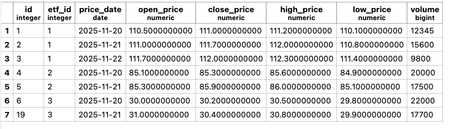
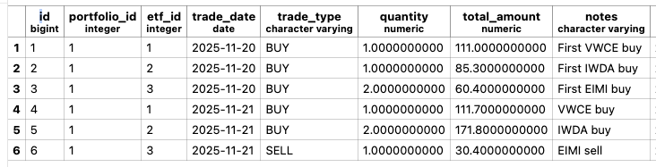

## Model valuation formulas

For a portfolio on date D:

- Position_i(D) = Quantity_i(D) \* ClosePrice_i(D)
  where i indicates a single ETF/instrument

- TotalValue(D) = Σ_i Position_i(D)

- NetFlow(D) = Σ_trades_in_D ( + total_amount per 'BUY' operations - total_amount per 'SELL' operations
  )

- CumulativeNetFlow(D) = Σ\_{t <= D} NetFlow(t)

- PnL(D) = TotalValue(D) - CumulativeNetFlow(D)

- Return(D) = PnL(D) / CumulativeNetFlow(D)
  (defined only if CumulativeNetFlow(D) > 0)

- PercentChange(D) = (TotalValue(D) − TotalValue(D−1)) / TotalValue(D−1)
  (just defined for D > first day)

- Peak(D) = max\_{t <= D} TotalValue(t)

- Drawdown(D) = (TotalValue(D) - Peak(D)) / Peak(D)
  (<= 0 when the value is lower than previous maximum)

- MaxDrawdown = min_D Drawdown(D)
  (the more negative Drawdown(D) value in the considered period)

## Example

- Position_1(2025-11-20) = (1 x 111.00) (ETF1)
- Position_2(2025-11-20) = (1 x 85.30) (ETF2)
- Position_3(2025-11-20) = (2 x 30.20) (ETF3)

- TotalValue(2025-11-20) = Position_1 + Position_2 + Position_3 = 256.70
- TotalValue(2025-11-21) = (2 x 111.70) + (3 x 85.90) + (1 x 30.40) = 511.5
- TotalValue(2025-11-22) = (2 x 112.0) = 224.00
  (assuming only VWCE has a price available on that date)

- NetFlow(2025-11-20) = 111.00 + 85.30 + 60.40 = 256.70
- NetFlow(2025-11-21) = 111.70 + 171.80 - 30.40 = 253.10

- CumulativeNetFlow(2025-11-21) = NetFlow(2025-11-20) + NetFlow(2025-11-21)
  = 111.00 + 85.3 + 60.40 + 111.70 + 171.80 - 30.40 = 509.80

- PnL(2025-11-21) = TotalValue(2025-11-21) - CumulativeNetFlow(2025-11-21)
  = 511.50 - 509.80 = 1.70

- Return(2025-11-21) = PnL(2025-11-21) / CumulativeNetFlow(2025-11-21)
  = 1.70 / 509.8 = 0.003

- PercentChange(2025-11-21) = (TotalValue(2025-11-21) − TotalValue(2025-11-20)) / TotalValue(2025-11-20)
  = 511.5 - 256.7 / 256.7 = 0.993

- Peak(2025-11-22) = 511.50

- Drawdown(2025-11-20)
  = (TotalValue(2025-11-20) - Peak(2025-11-20)) / Peak(2025-11-20)
  = (256.70 - 256.70) / 256.70 = 0

- Drawdown(2025-11-21)
  = (TotalValue(2025-11-21) - Peak(2025-11-21)) / Peak(2025-11-21)
  = (511.50 - 511.50) / 511.50 = 0

- Drawdown(2025-11-22)
  = (TotalValue(2025-11-22) - Peak(2025-11-22)) / Peak(2025-11-22)
  = (224 - 511.50) / 511.50 = -0.562

- MaxDrawdown = min_D Drawdown(D) = - 0.562
