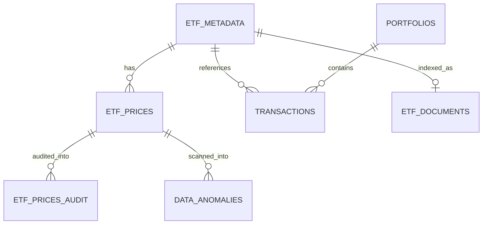
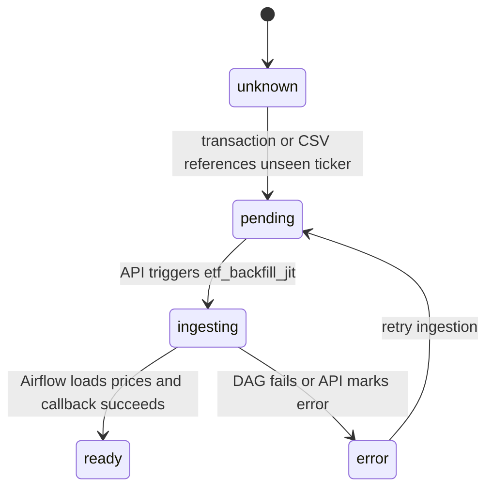

# PostgreSQL Schema Overview

This document describes the schema that is actually used by the platform today.
The source of truth for initialization remains the SQL files in this folder:

- `00_init_extensions.sql`
- `01_etf_metadata_schema.sql`
- `02_etf_prices_schema.sql`
- `03_portfolio_schema.sql`
- `04_etf_documents_schema.sql`
- `05_etf_prices_audit_schema.sql`
- `06_data_anomalies_schema.sql`
- `07_multi_tenancy.sql`
- `08_etf_ingestion_status.sql`

It is intentionally a documentation file, not a migration file.

---

## Core Data Model



### `etf_metadata`

Master table for instruments known to the platform.

Primary columns:

- `id BIGINT`
- `ticker VARCHAR(10) UNIQUE NOT NULL`
- `isin VARCHAR(12)`
- `name VARCHAR(50) NOT NULL`
- `is_active BOOL DEFAULT TRUE`
- `created_at TIMESTAMPTZ DEFAULT now()`
- `last_sync TIMESTAMPTZ`

JIT ingestion lifecycle columns:

- `status etf_ingestion_status NOT NULL DEFAULT 'unknown'`
- `ingestion_requested_at TIMESTAMPTZ`
- `ingestion_completed_at TIMESTAMPTZ`
- `ingestion_error TEXT`

Purpose:

- FK anchor for `transactions`
- source of truth for active tickers
- lifecycle tracker for Just-in-Time ingestion

### `etf_prices`

Historical OHLCV market data.

Primary columns:

- `id BIGINT`
- `ticker VARCHAR(10) NOT NULL`
- `price_date DATE NOT NULL`
- `open_price NUMERIC(18,6)`
- `high_price NUMERIC(18,6)`
- `low_price NUMERIC(18,6)`
- `close_price NUMERIC(18,6)`
- `volume BIGINT`
- `currency VARCHAR(3) NOT NULL DEFAULT 'USD'`
- `created_at TIMESTAMPTZ DEFAULT now()`

Constraints and indexes:

- primary key on `id`
- unique key on `(ticker, price_date)`
- index on `price_date DESC`
- index on `(ticker, price_date DESC)`

Purpose:

- portfolio valuation
- TWRR input
- anomaly scanning
- price audit trigger source

### `portfolios`

Portfolio master data.

Primary columns:

- `id UUID PRIMARY KEY`
- `name VARCHAR(100) NOT NULL`
- `currency VARCHAR(3) DEFAULT 'EUR'`
- `created_at TIMESTAMP DEFAULT now()`
- `user_id UUID`

Purpose:

- top-level tenant-owned portfolio entity

### `transactions`

Portfolio transaction ledger.

Primary columns:

- `id UUID PRIMARY KEY`
- `portfolio_id UUID NOT NULL`
- `ticker VARCHAR(20) NOT NULL`
- `transaction_date DATE NOT NULL`
- `type VARCHAR(10) NOT NULL`
- `units NUMERIC(18,4) NOT NULL`
- `price_per_unit NUMERIC(18,4) NOT NULL`
- `fees NUMERIC(18,4) DEFAULT 0`

Constraints and indexes:

- FK `portfolio_id -> portfolios(id)` with `ON DELETE CASCADE`
- FK `ticker -> etf_metadata(ticker)` with `ON DELETE RESTRICT`
- indexes on `portfolio_id`, `ticker`, `transaction_date`
- composite indexes on `(portfolio_id, transaction_date)` and `(portfolio_id, ticker, transaction_date)`

Purpose:

- source of truth for holdings and portfolio analytics

### `etf_documents`

Semantic-search document store.

Primary columns:

- `id UUID PRIMARY KEY`
- `ticker VARCHAR(20) NOT NULL UNIQUE`
- `content TEXT NOT NULL`
- `metadata JSONB`
- `embedding vector(768)`
- `created_at TIMESTAMP DEFAULT now()`
- `is_mandatory BOOL DEFAULT FALSE`

Indexes:

- HNSW index on `embedding vector_cosine_ops`

Purpose:

- pgvector-backed semantic search
- RAG context retrieval

### `etf_prices_audit`

Audit table for price mutations.

Primary columns:

- `id UUID PRIMARY KEY`
- `ticker VARCHAR(20) NOT NULL`
- `price_date DATE NOT NULL`
- `old_close_price NUMERIC(18,4)`
- `new_close_price NUMERIC(18,4)`
- `change_type VARCHAR(10)`
- `changed_at TIMESTAMP DEFAULT now()`
- `changed_by VARCHAR(50) DEFAULT 'system'`

Purpose:

- track updates and deletes on `etf_prices`

### `data_anomalies`

Persistent anomaly log produced by the data quality scanner.

Primary columns:

- `id UUID PRIMARY KEY`
- `ticker VARCHAR(20) NOT NULL`
- `price_date DATE NOT NULL`
- `rule_name VARCHAR(100) NOT NULL`
- `severity VARCHAR(20) NOT NULL`
- `current_value NUMERIC(18,4)`
- `expected_range VARCHAR(100)`
- `message TEXT`
- `metadata JSONB`
- `detected_at TIMESTAMP DEFAULT now()`
- `resolved BOOLEAN DEFAULT FALSE`
- `resolved_at TIMESTAMP`
- `resolved_by VARCHAR(50)`

Constraints and indexes:

- unique constraint on `(ticker, price_date, rule_name)`
- index on `(ticker, price_date DESC)`
- index on `detected_at DESC`
- partial index for unresolved anomalies

Purpose:

- idempotent anomaly storage across retries and repeated scans

---

## JIT Ingestion Lifecycle

The `status` column on `etf_metadata` is central to the V2 JIT ingestion design.

### Enum values

`etf_ingestion_status` contains:

- `unknown`
- `pending`
- `ingesting`
- `ready`
- `error`

### State flow



### How it is used

- the API inserts a placeholder `etf_metadata` row before saving a transaction
- Airflow writes price history into `etf_prices`
- Airflow and the API update `status` as the DAG progresses
- the frontend polls `/api/ingestion/{ticker}/status`

This gives the system a stable FK target and a visible ingestion lifecycle for the UI.

---

## Row-Level Security (RLS)

Guest-session multi-tenancy is implemented at the portfolio layer.

### Columns and index

`07_multi_tenancy.sql` adds:

- `portfolios.user_id UUID`
- `idx_portfolios_user_id`

### Policies

`portfolios` has:

- `ENABLE ROW LEVEL SECURITY`
- `FORCE ROW LEVEL SECURITY`

Main policy:

```sql
CREATE POLICY portfolios_tenant_isolation ON portfolios
    USING (
        user_id IS NULL
        OR user_id = current_setting('app.user_id', true)::uuid
    );
```

### Runtime behavior

The API sets the current guest id into PostgreSQL session context with:

```sql
SELECT set_config('app.user_id', @UserId, true)
```

This allows PostgreSQL to filter visible portfolio rows based on the active guest session.

### Important nuance

RLS currently applies to `portfolios`, not to every table in the schema.
Application-layer filtering is still responsible for part of the tenant-isolation model, especially on transaction-related flows.

---

## Supporting Objects

### Extensions

`00_init_extensions.sql` enables:

- `vector`

This is required for pgvector embeddings in `etf_documents`.

### Audit trigger

`05_etf_prices_audit_schema.sql` creates:

- function `log_price_changes()`
- trigger `trg_audit_prices`

The trigger writes to `etf_prices_audit` on:

- `UPDATE`
- `DELETE`

### Seed data

`01_etf_metadata_schema.sql` and `03_portfolio_schema.sql` include seed data for:

- demo ETFs and equities
- demo portfolios
- demo transactions

---

## Performance-Oriented Indexes

The current schema includes indexes optimized for the main application queries:

- `etf_prices`
  - recent prices by ticker
  - date-window scans
- `transactions`
  - portfolio transaction history
  - portfolio+ticker analytics access
- `data_anomalies`
  - unresolved anomaly dashboard
  - recent anomaly lookups by ticker
- `etf_documents`
  - vector similarity search with HNSW
- `portfolios`
  - user ownership lookup

---

## Known Limitations

This schema reflects the real current system, but a few design areas are still in progress:

- multi-currency support is only partial
- RLS is not yet applied to every tenant-relevant table
- `transactions` still overload trade and cash-flow concepts
- JIT makes any ticker ingestible, but long-term scheduled refresh for every new ticker depends on current Airflow orchestration design
